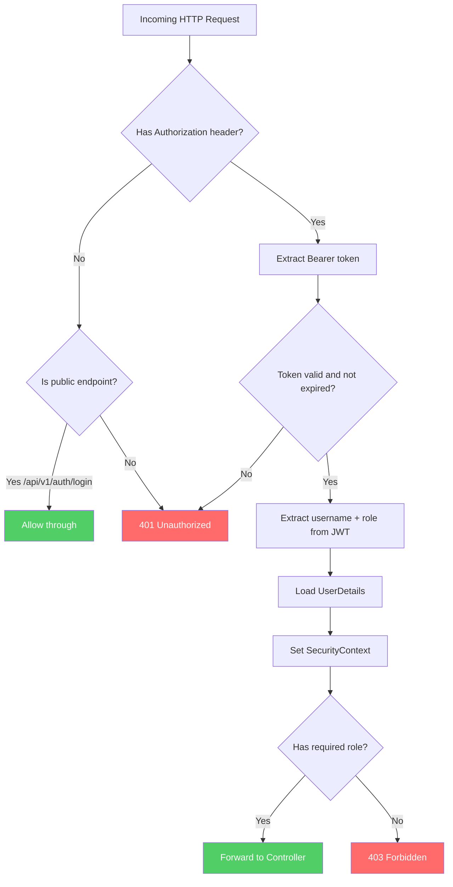
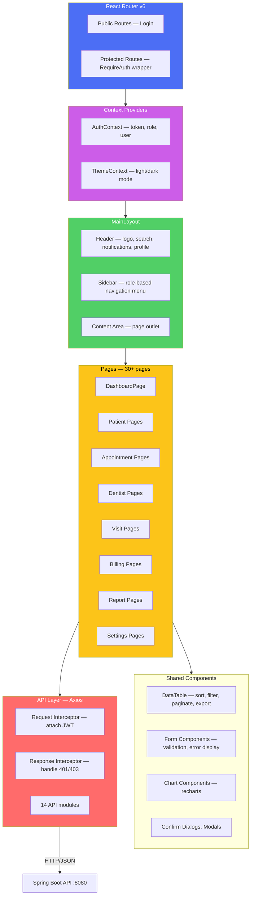
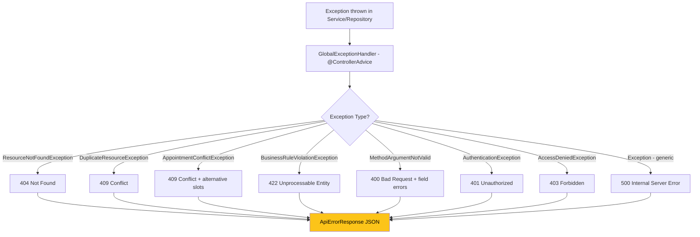

# System Architecture Design Document — Part 1: Architecture Overview

**Document ID:** SDC-ADD-001 | **Version:** 1.0 | **Date:** 14 July 2026  
**Project:** Sunrise Dental Clinic Management System (SDCMS)  
**Author:** Solution Architect — Vareka Engineering Team  
**Status:** Awaiting Approval

---

## 1. Architecture Goals & Principles

### 1.1 Architecture Goals

| # | Goal | Rationale |
|---|---|---|
| AG-1 | Separation of Concerns | Each layer handles one responsibility — reduces coupling |
| AG-2 | Testability | Every layer independently testable via mocking |
| AG-3 | Scalability | Stateless backend enables horizontal scaling |
| AG-4 | Security by Design | Authentication/authorization woven into every request |
| AG-5 | Maintainability | Clean code structure for long-term evolution |
| AG-6 | Deployability | Single Docker Compose command deploys full stack |

### 1.2 Design Principles

| Principle | Application |
|---|---|
| **Single Responsibility** | Each class has one reason to change (e.g., PatientService only handles patient business logic) |
| **Open/Closed** | New treatment types added via enum extension, not code modification |
| **Liskov Substitution** | All services implement interfaces; swappable implementations |
| **Interface Segregation** | Fine-grained service interfaces (no "god" service) |
| **Dependency Inversion** | Controllers depend on service interfaces, not implementations |
| **DRY** | Shared validation, mapping, and exception handling via base classes |
| **YAGNI** | Only features specified in SRS are implemented |

---

## 2. High-Level Architecture

### 2.1 Layered Architecture Diagram

```mermaid
flowchart TB
    subgraph CLIENT["🌐 Client Tier"]
        BROWSER["Web Browser"]
    end

    subgraph PRESENTATION["📱 Presentation Layer — React + TypeScript + Vite"]
        PAGES["Pages / Routes"]
        COMPONENTS["UI Components — Material UI"]
        HOOKS["Custom Hooks"]
        CONTEXT["Auth Context / Theme Context"]
        AXIOS["API Client — Axios + Interceptors"]
    end

    subgraph GATEWAY["🔒 API Gateway Layer — Spring Security"]
        CORS_F["CORS Filter"]
        JWT_F["JWT Authentication Filter"]
        SEC_CFG["Security Configuration"]
    end

    subgraph CONTROLLER["🎯 Controller Layer — Spring MVC REST"]
        direction LR
        C1["AuthController"]
        C2["PatientController"]
        C3["AppointmentController"]
        C4["DentistController"]
        C5["TreatmentController"]
        C6["VisitController"]
        C7["BillController"]
        C8["ReportController"]
        C9["SearchController"]
        C10["SettingsController"]
        C11["UserController"]
        C12["AuditLogController"]
        C13["NotificationController"]
        C14["DashboardController"]
    end

    subgraph DTO_LAYER["📦 DTO / Mapper Layer"]
        REQ["Request DTOs — Validation Annotations"]
        RES["Response DTOs — API Contracts"]
        MAP["ModelMapper / MapStruct"]
    end

    subgraph SERVICE["⚙️ Service Layer — Business Logic"]
        direction LR
        S1["AuthService"]
        S2["PatientService"]
        S3["AppointmentService"]
        S4["DentistService"]
        S5["TreatmentService"]
        S6["VisitService"]
        S7["BillService"]
        S8["ReportService"]
        S9["SearchService"]
        S10["SettingsService"]
        S11["UserService"]
        S12["AuditLogService"]
        S13["NotificationService"]
        S14["PdfService"]
        S15["ExcelService"]
    end

    subgraph REPOSITORY["📂 Repository Layer — Spring Data JPA"]
        direction LR
        R1["UserRepository"]
        R2["PatientRepository"]
        R3["AppointmentRepository"]
        R4["DentistRepository"]
        R5["DentistScheduleRepository"]
        R6["TreatmentRepository"]
        R7["VisitRepository"]
        R8["VisitTreatmentRepository"]
        R9["BillRepository"]
        R10["AuditLogRepository"]
        R11["NotificationRepository"]
        R12["ClinicSettingsRepository"]
    end

    subgraph PERSISTENCE["🗄️ Persistence Layer"]
        JPA["Hibernate / JPA"]
        FLYWAY["Flyway Migrations"]
        PG["PostgreSQL 15"]
    end

    CLIENT --> PRESENTATION
    PRESENTATION -->|"HTTP/JSON"| GATEWAY
    GATEWAY --> CONTROLLER
    CONTROLLER --> DTO_LAYER
    DTO_LAYER --> SERVICE
    SERVICE --> REPOSITORY
    REPOSITORY --> PERSISTENCE

    style CLIENT fill:#868e96,color:#fff
    style PRESENTATION fill:#4c6ef5,color:#fff
    style GATEWAY fill:#ff6b6b,color:#fff
    style CONTROLLER fill:#51cf66,color:#fff
    style DTO_LAYER fill:#cc5de8,color:#fff
    style SERVICE fill:#fcc419,color:#000
    style REPOSITORY fill:#ff922b,color:#fff
    style PERSISTENCE fill:#20c997,color:#fff
```



### 2.2 Layer Rules (Strict)

| Layer | Can Call | Cannot Call | Contains |
|---|---|---|---|
| **Controller** | DTO Layer, Service | Repository, Database | Request validation, HTTP mapping, response building |
| **DTO Layer** | — | — | Request/Response DTOs, validation annotations, mappers |
| **Service** | Repository, other Services | Controller, Database directly | All business rules, transaction management, orchestration |
| **Repository** | JPA/Hibernate | Service, Controller | Data access methods, custom queries, projections |
| **Persistence** | Database | Any upper layer | Entity mappings, migrations, constraints |

### 2.3 Architecture Decision Records

| ADR | Decision | Alternatives Considered | Rationale |
|---|---|---|---|
| ADR-001 | Layered architecture | Hexagonal, Clean | Simpler for team; well-understood; Spring Boot naturally supports it |
| ADR-002 | REST API (not GraphQL) | GraphQL | REST is simpler; fits CRUD-heavy domain; better tooling (Swagger) |
| ADR-003 | JWT (not session-based) | Server sessions | Stateless = horizontally scalable; no server-side session store needed |
| ADR-004 | PostgreSQL (not MySQL) | MySQL, H2 | Superior JSON support, better indexing, enterprise-grade reliability |
| ADR-005 | Spring Data JPA (not raw JDBC) | JDBC Template, MyBatis | Productivity; type-safe queries; automatic repository generation |
| ADR-006 | React + MUI (not Angular) | Angular, Vue | Largest ecosystem; MUI provides enterprise-ready components |
| ADR-007 | Vite (not CRA) | Create React App | 10x faster dev builds; native ESM; modern standard |
| ADR-008 | Flyway (not Liquibase) | Liquibase | SQL-native migrations; simpler; sufficient for PostgreSQL |
| ADR-009 | Docker Compose (not K8s) | Kubernetes | Single-clinic deployment; K8s is over-engineered for this scale |
| ADR-010 | Soft delete (not hard delete) | Hard delete | Audit compliance; data recovery; referential integrity preserved |

---

## 3. Security Architecture

### 3.1 Authentication Flow

```mermaid
flowchart LR
    A["POST /api/v1/auth/login"] --> B["AuthController"]
    B --> C["AuthService.authenticate()"]
    C --> D["UserDetailsService.loadByUsername()"]
    D --> E["BCrypt.matches(password, hash)"]
    E -->|Success| F["JwtTokenProvider.generateToken()"]
    F --> G["Return JWT + Role + Name"]
    E -->|Failure| H["Increment failedAttempts"]
    H --> I["401 Unauthorized"]

    subgraph JWT_CONTENT["JWT Token Payload"]
        J["sub: username"]
        K["role: ADMIN"]
        L["iat: issued timestamp"]
        M["exp: expiry timestamp"]
    end

    G -.-> JWT_CONTENT

    style F fill:#51cf66,color:#fff
    style I fill:#ff6b6b,color:#fff
```



### 3.2 Request Authorization Flow



### 3.3 Security Configuration Matrix

| Endpoint Pattern | Public | RECEPTIONIST | DENTIST | ADMIN |
|---|---|---|---|---|
| `POST /api/v1/auth/login` | ✅ | — | — | — |
| `GET /api/v1/patients/**` | ❌ | ✅ | ✅ | ✅ |
| `POST /api/v1/patients` | ❌ | ✅ | ❌ | ✅ |
| `POST /api/v1/appointments` | ❌ | ✅ | ❌ | ✅ |
| `POST /api/v1/visits` | ❌ | ❌ | ✅ | ✅ |
| `PUT /api/v1/visits/**` | ❌ | ❌ | ✅ | ✅ |
| `POST /api/v1/bills` | ❌ | ✅ | ❌ | ✅ |
| `GET /api/v1/reports/**` | ❌ | ❌ | ❌ | ✅ |
| `GET /api/v1/audit-logs/**` | ❌ | ❌ | ❌ | ✅ |
| `PUT /api/v1/settings/**` | ❌ | ❌ | ❌ | ✅ |
| `POST /api/v1/users` | ❌ | ❌ | ❌ | ✅ |
| `GET /api/v1/dashboard/**` | ❌ | ✅ | ✅ | ✅ |

---

## 4. Backend Architecture (Spring Boot)

### 4.1 Project Structure

```
backend/
├── src/main/java/com/sunrisedental/
│   ├── SunriseDentalApplication.java
│   ├── config/
│   │   ├── SecurityConfig.java
│   │   ├── CorsConfig.java
│   │   ├── SwaggerConfig.java
│   │   ├── AuditConfig.java
│   │   └── WebMvcConfig.java
│   ├── security/
│   │   ├── JwtAuthenticationFilter.java
│   │   ├── JwtTokenProvider.java
│   │   ├── JwtAuthenticationEntryPoint.java
│   │   └── UserDetailsServiceImpl.java
│   ├── controller/
│   │   ├── AuthController.java
│   │   ├── PatientController.java
│   │   ├── AppointmentController.java
│   │   ├── DentistController.java
│   │   ├── TreatmentController.java
│   │   ├── VisitController.java
│   │   ├── BillController.java
│   │   ├── ReportController.java
│   │   ├── SearchController.java
│   │   ├── SettingsController.java
│   │   ├── UserController.java
│   │   ├── AuditLogController.java
│   │   ├── NotificationController.java
│   │   └── DashboardController.java
│   ├── dto/
│   │   ├── request/
│   │   │   ├── LoginRequest.java
│   │   │   ├── PatientRequest.java
│   │   │   ├── AppointmentRequest.java
│   │   │   ├── DentistRequest.java
│   │   │   ├── TreatmentRequest.java
│   │   │   ├── VisitRequest.java
│   │   │   ├── BillRequest.java
│   │   │   ├── ChangePasswordRequest.java
│   │   │   └── UserRequest.java
│   │   └── response/
│   │       ├── AuthResponse.java
│   │       ├── PatientResponse.java
│   │       ├── AppointmentResponse.java
│   │       ├── DentistResponse.java
│   │       ├── TreatmentResponse.java
│   │       ├── VisitResponse.java
│   │       ├── BillResponse.java
│   │       ├── ReportResponse.java
│   │       ├── DashboardResponse.java
│   │       ├── NotificationResponse.java
│   │       ├── AuditLogResponse.java
│   │       ├── PagedResponse.java
│   │       └── ApiErrorResponse.java
│   ├── service/
│   │   ├── AuthService.java
│   │   ├── PatientService.java
│   │   ├── AppointmentService.java
│   │   ├── DentistService.java
│   │   ├── TreatmentService.java
│   │   ├── VisitService.java
│   │   ├── BillService.java
│   │   ├── ReportService.java
│   │   ├── SearchService.java
│   │   ├── SettingsService.java
│   │   ├── UserService.java
│   │   ├── AuditLogService.java
│   │   ├── NotificationService.java
│   │   ├── PdfService.java
│   │   └── ExcelService.java
│   ├── repository/
│   │   ├── UserRepository.java
│   │   ├── PatientRepository.java
│   │   ├── AppointmentRepository.java
│   │   ├── DentistRepository.java
│   │   ├── DentistScheduleRepository.java
│   │   ├── TreatmentRepository.java
│   │   ├── VisitRepository.java
│   │   ├── VisitTreatmentRepository.java
│   │   ├── BillRepository.java
│   │   ├── AuditLogRepository.java
│   │   ├── NotificationRepository.java
│   │   └── ClinicSettingsRepository.java
│   ├── entity/
│   │   ├── User.java
│   │   ├── Patient.java
│   │   ├── Dentist.java
│   │   ├── DentistSchedule.java
│   │   ├── Treatment.java
│   │   ├── Appointment.java
│   │   ├── PatientVisit.java
│   │   ├── VisitTreatment.java
│   │   ├── Bill.java
│   │   ├── AuditLog.java
│   │   ├── Notification.java
│   │   ├── ClinicSettings.java
│   │   └── enums/
│   │       ├── Role.java
│   │       ├── Gender.java
│   │       ├── PatientStatus.java
│   │       ├── DentistStatus.java
│   │       ├── AppointmentStatus.java
│   │       ├── TreatmentType.java
│   │       ├── TreatmentStatus.java
│   │       ├── VisitTreatmentStatus.java
│   │       ├── PaymentStatus.java
│   │       ├── PaymentMethod.java
│   │       ├── AuditAction.java
│   │       ├── NotificationType.java
│   │       └── SettingCategory.java
│   ├── exception/
│   │   ├── GlobalExceptionHandler.java
│   │   ├── ResourceNotFoundException.java
│   │   ├── DuplicateResourceException.java
│   │   ├── AppointmentConflictException.java
│   │   ├── BusinessRuleViolationException.java
│   │   └── UnauthorizedException.java
│   ├── mapper/
│   │   ├── PatientMapper.java
│   │   ├── AppointmentMapper.java
│   │   ├── DentistMapper.java
│   │   ├── TreatmentMapper.java
│   │   ├── VisitMapper.java
│   │   ├── BillMapper.java
│   │   └── UserMapper.java
│   └── util/
│       ├── CodeGenerator.java
│       ├── DateUtils.java
│       └── ValidationUtils.java
├── src/main/resources/
│   ├── application.yml
│   ├── application-dev.yml
│   ├── application-prod.yml
│   └── db/migration/
│       ├── V1__create_users_table.sql
│       ├── V2__create_patients_table.sql
│       ├── V3__create_dentists_table.sql
│       ├── V4__create_treatments_table.sql
│       ├── V5__create_appointments_table.sql
│       ├── V6__create_patient_visits_table.sql
│       ├── V7__create_bills_table.sql
│       ├── V8__create_audit_logs_table.sql
│       ├── V9__create_notifications_table.sql
│       ├── V10__create_clinic_settings_table.sql
│       ├── V11__create_indexes.sql
│       ├── V12__seed_data.sql
│       └── V13__create_views_and_functions.sql
├── src/test/java/com/sunrisedental/
│   ├── controller/
│   ├── service/
│   ├── repository/
│   └── integration/
├── pom.xml
├── Dockerfile
└── .env
```

### 4.2 Key Dependencies (pom.xml)

| Dependency | Version | Purpose |
|---|---|---|
| spring-boot-starter-web | 3.3.x | REST API, embedded Tomcat |
| spring-boot-starter-data-jpa | 3.3.x | JPA repositories, Hibernate |
| spring-boot-starter-security | 3.3.x | Authentication, authorization |
| spring-boot-starter-validation | 3.3.x | Bean validation (Jakarta) |
| jjwt-api + impl + jackson | 0.12.x | JWT token generation/validation |
| postgresql | 42.7.x | JDBC driver |
| flyway-core | 10.x | Database migrations |
| lombok | 1.18.x | Boilerplate reduction |
| springdoc-openapi-starter | 2.5.x | Swagger UI + OpenAPI 3 |
| itext7-core | 8.x | PDF generation |
| apache-poi | 5.2.x | Excel export |
| spring-boot-starter-test | 3.3.x | JUnit 5, Mockito |
| spring-security-test | 6.x | Security test support |

---

## 5. Frontend Architecture (React)

### 5.1 Project Structure

```
frontend/
├── src/
│   ├── main.tsx
│   ├── App.tsx
│   ├── routes.tsx
│   ├── api/
│   │   ├── axiosConfig.ts
│   │   ├── authApi.ts
│   │   ├── patientApi.ts
│   │   ├── appointmentApi.ts
│   │   ├── dentistApi.ts
│   │   ├── treatmentApi.ts
│   │   ├── visitApi.ts
│   │   ├── billApi.ts
│   │   ├── reportApi.ts
│   │   ├── searchApi.ts
│   │   ├── settingsApi.ts
│   │   ├── userApi.ts
│   │   ├── notificationApi.ts
│   │   └── dashboardApi.ts
│   ├── components/
│   │   ├── layout/
│   │   │   ├── MainLayout.tsx
│   │   │   ├── Sidebar.tsx
│   │   │   ├── Header.tsx
│   │   │   └── Footer.tsx
│   │   ├── common/
│   │   │   ├── DataTable.tsx
│   │   │   ├── SearchBar.tsx
│   │   │   ├── ConfirmDialog.tsx
│   │   │   ├── LoadingSpinner.tsx
│   │   │   ├── StatusBadge.tsx
│   │   │   ├── PageHeader.tsx
│   │   │   └── ExportButtons.tsx
│   │   ├── charts/
│   │   │   ├── RevenueChart.tsx
│   │   │   ├── AppointmentChart.tsx
│   │   │   └── TreatmentChart.tsx
│   │   └── forms/
│   │       ├── PatientForm.tsx
│   │       ├── AppointmentForm.tsx
│   │       ├── DentistForm.tsx
│   │       ├── TreatmentForm.tsx
│   │       ├── VisitForm.tsx
│   │       └── BillForm.tsx
│   ├── pages/
│   │   ├── auth/
│   │   │   ├── LoginPage.tsx
│   │   │   └── ChangePasswordPage.tsx
│   │   ├── dashboard/
│   │   │   └── DashboardPage.tsx
│   │   ├── patients/
│   │   │   ├── PatientListPage.tsx
│   │   │   ├── PatientDetailPage.tsx
│   │   │   └── PatientFormPage.tsx
│   │   ├── appointments/
│   │   │   ├── AppointmentListPage.tsx
│   │   │   ├── AppointmentDetailPage.tsx
│   │   │   ├── AppointmentFormPage.tsx
│   │   │   └── TodayAppointmentsPage.tsx
│   │   ├── dentists/
│   │   ├── treatments/
│   │   ├── visits/
│   │   ├── billing/
│   │   ├── reports/
│   │   ├── search/
│   │   ├── settings/
│   │   ├── audit/
│   │   ├── help/
│   │   └── profile/
│   ├── context/
│   │   ├── AuthContext.tsx
│   │   └── ThemeContext.tsx
│   ├── hooks/
│   │   ├── useAuth.ts
│   │   ├── useApi.ts
│   │   ├── useDebounce.ts
│   │   └── useNotifications.ts
│   ├── types/
│   │   ├── patient.ts
│   │   ├── appointment.ts
│   │   ├── dentist.ts
│   │   ├── treatment.ts
│   │   ├── visit.ts
│   │   ├── bill.ts
│   │   ├── user.ts
│   │   ├── report.ts
│   │   └── common.ts
│   ├── utils/
│   │   ├── formatters.ts
│   │   ├── validators.ts
│   │   └── constants.ts
│   └── theme/
│       ├── lightTheme.ts
│       └── darkTheme.ts
├── public/
├── index.html
├── vite.config.ts
├── tsconfig.json
├── package.json
├── Dockerfile
└── nginx.conf
```

### 5.2 Frontend Architecture Diagram



---

## 6. Cross-Cutting Concerns

### 6.1 Exception Handling Strategy



**Standard Error Response:**
```json
{
  "status": 400,
  "message": "Validation failed",
  "timestamp": "2026-07-14T10:30:00",
  "errors": [
    {"field": "nic", "message": "NIC must be unique"},
    {"field": "telephone", "message": "Invalid Sri Lankan phone format"}
  ]
}
```

### 6.2 Audit Logging Strategy

| Trigger | Mechanism | Data Captured |
|---|---|---|
| Entity CREATE/UPDATE/DELETE | `@EntityListeners(AuditListener.class)` on JPA entities | username, action, entity type, entity ID, old JSON, new JSON, IP, timestamp |
| Login/Logout | Explicit call in AuthService | username, action, IP, timestamp |
| Query | Not logged (read operations are non-destructive) | — |

### 6.3 Transaction Management

| Rule | Implementation |
|---|---|
| All service methods that modify data use `@Transactional` | Spring declarative transactions |
| Read-only methods use `@Transactional(readOnly = true)` | Hibernate optimization |
| Multi-step operations (e.g., visit → appointment status update) | Single transaction boundary |
| Rollback on any RuntimeException | Default Spring behavior |

---

> **PHASE 3: SYSTEM ARCHITECTURE — COMPLETED**
