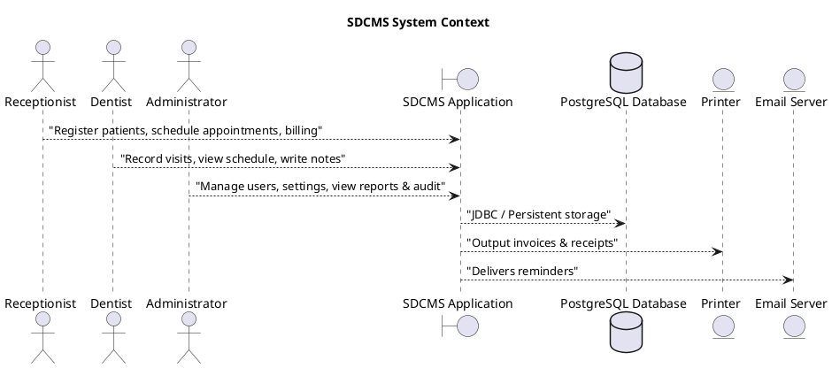
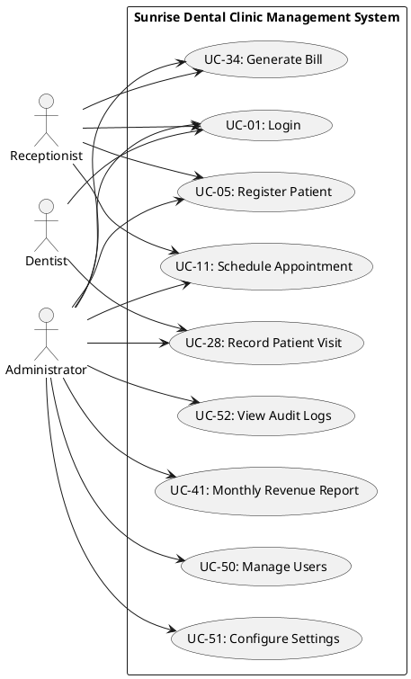
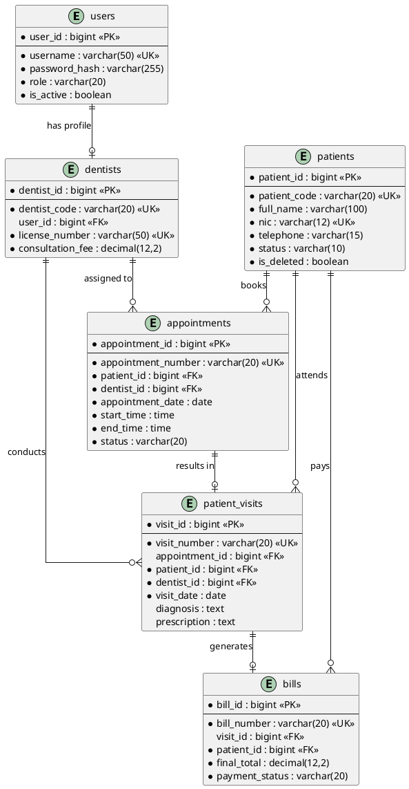
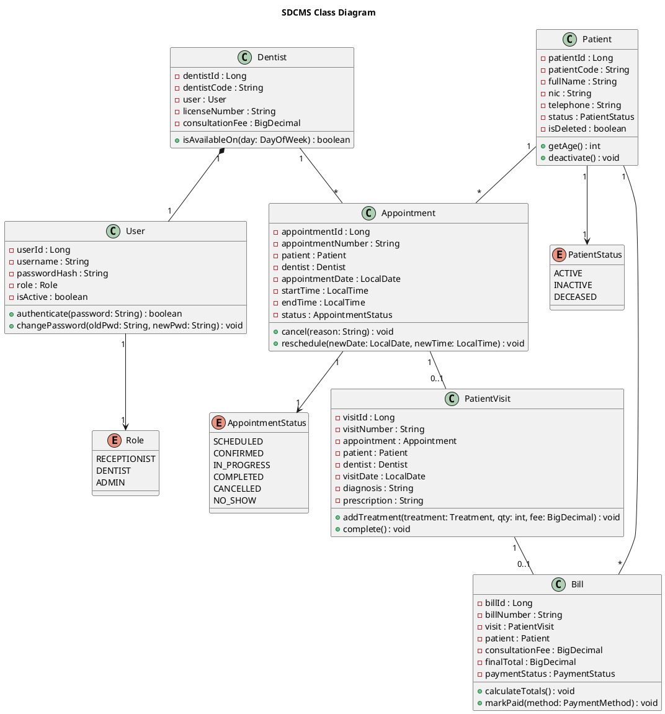
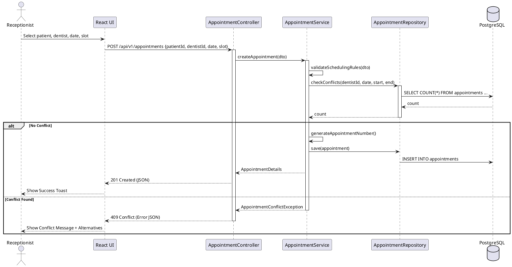
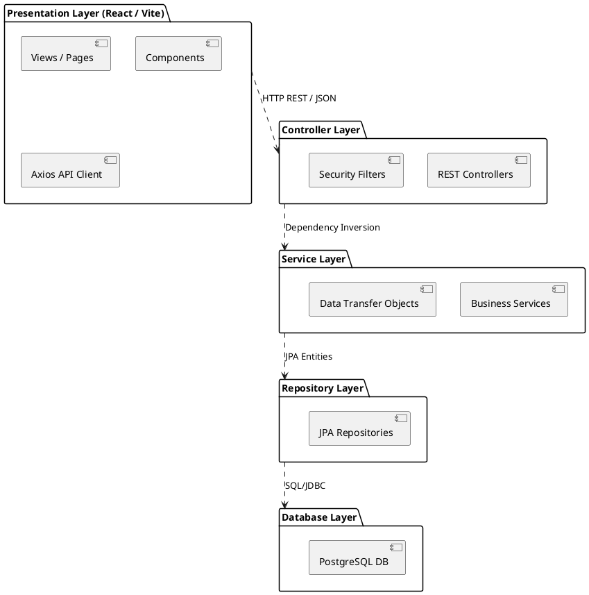
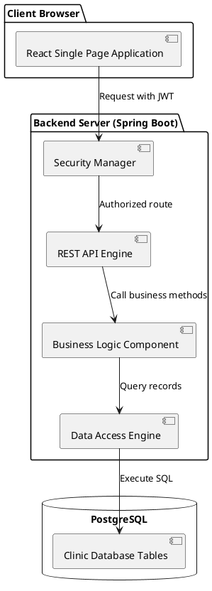
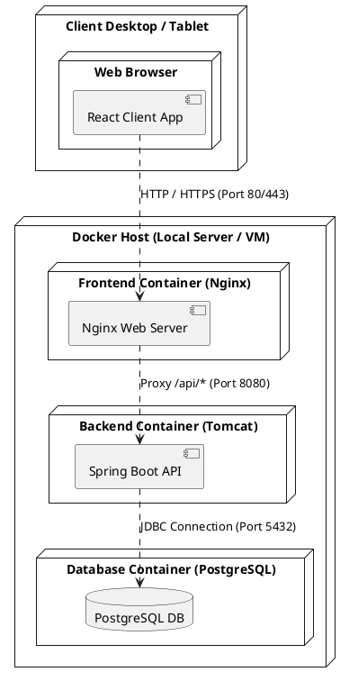

# UML Design Document — Sunrise Dental Clinic Management System

**Document ID:** SDC-UML-001  
**Version:** 1.0  
**Date:** 14 July 2026  
**Project:** Sunrise Dental Clinic Management System (SDCMS)  
**Author:** UML Expert — Vareka Engineering Team  
**Status:** Awaiting Approval  

---

## 1. Introduction

This document contains the PlantUML specifications for the system's core design. These specifications complement the Mermaid diagrams generated in Phase 1 and satisfy the requirements for enterprise-grade modeling.

---

## 2. System Context Diagram (PlantUML)

---

## 3. Use Case Diagram (PlantUML)

---

## 4. Entity Relationship Diagram (PlantUML)

---

## 5. Domain Class Diagram (PlantUML)

---

## 6. Sequence Diagram — Appointment Scheduling (PlantUML)

---

## 7. Package Diagram (PlantUML)

---

## 8. Component Diagram (PlantUML)

---

## 9. Deployment Diagram (PlantUML)

---

> **PHASE 5: UML DESIGN — COMPLETED**
