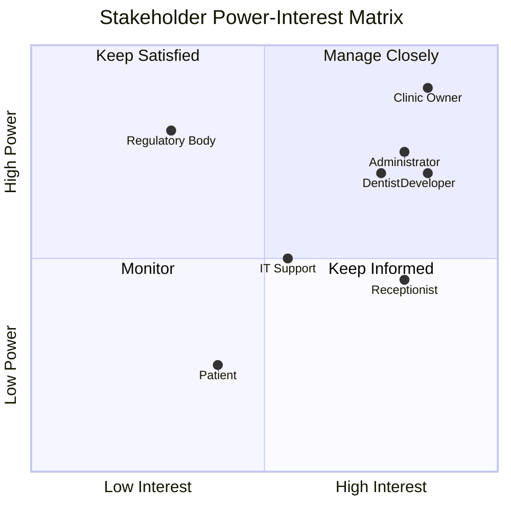
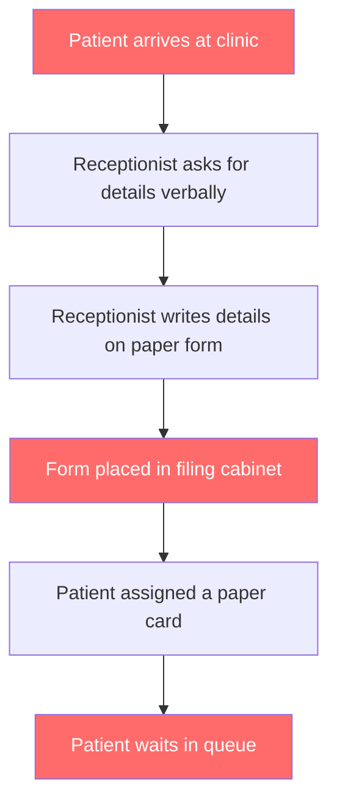
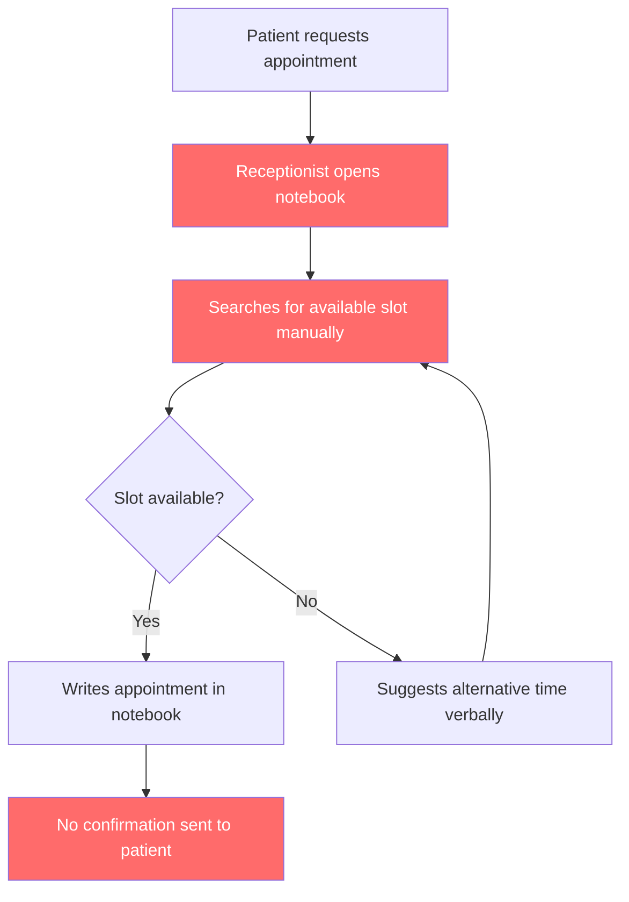
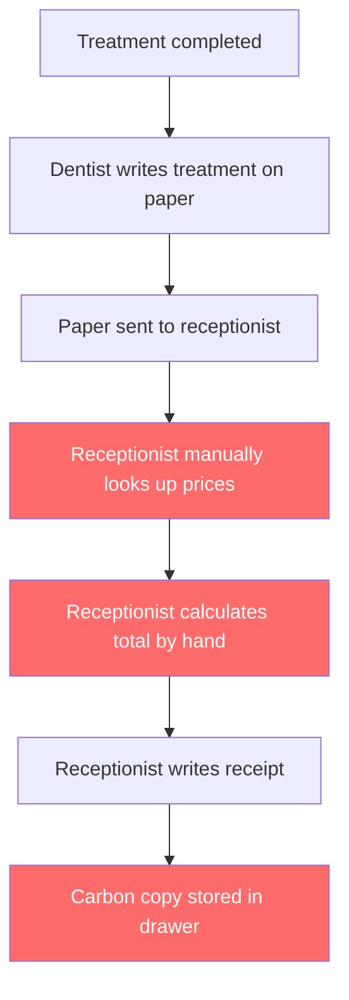
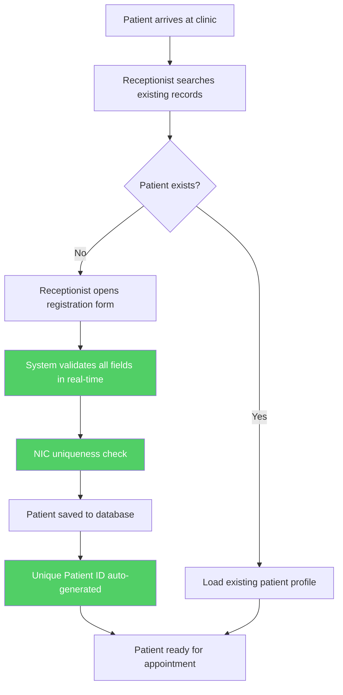
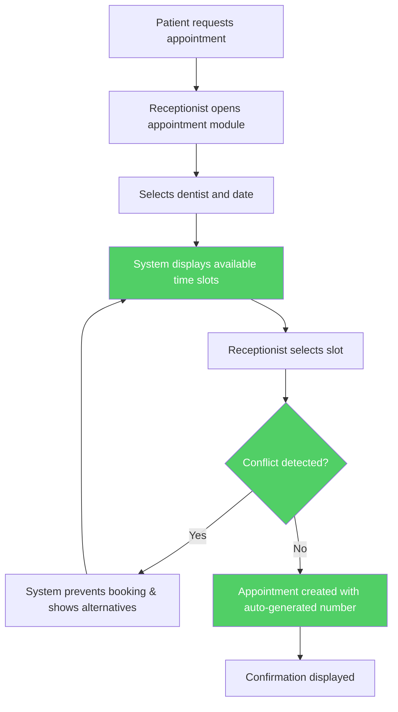
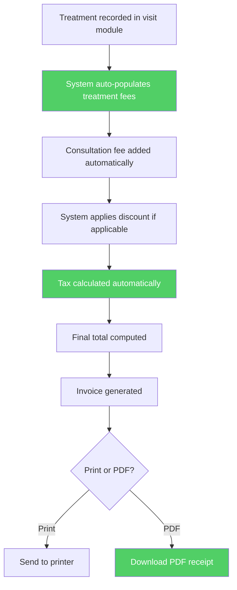

# Sunrise Dental Clinic Management System — Business Analysis

**Document ID:** SDC-BA-001  
**Version:** 1.0  
**Date:** 14 July 2026  
**Author:** Business Analyst — Vareka Engineering Team  
**Status:** Awaiting Approval  
**Classification:** Confidential  

---

## Table of Contents

1. [Executive Summary](#1-executive-summary)
2. [Business Context](#2-business-context)
3. [Problem Statement](#3-problem-statement)
4. [Stakeholder Analysis](#4-stakeholder-analysis)
5. [Current Business Process (As-Is)](#5-current-business-process-as-is)
6. [Proposed Business Process (To-Be)](#6-proposed-business-process-to-be)
7. [Business Objectives](#7-business-objectives)
8. [Scope Definition](#8-scope-definition)
9. [Functional Scope Matrix](#9-functional-scope-matrix)
10. [Business Rules](#10-business-rules)
11. [Assumptions](#11-assumptions)
12. [Constraints](#12-constraints)
13. [Risks & Mitigations](#13-risks--mitigations)
14. [Cost-Benefit Analysis](#14-cost-benefit-analysis)
15. [Success Criteria](#15-success-criteria)
16. [Glossary](#16-glossary)
17. [Sign-Off](#17-sign-off)

---

## 1. Executive Summary

Sunrise Dental Clinic is a private dental practice operating in Colombo, Sri Lanka. The clinic currently manages all operations — patient registration, appointment scheduling, treatment records, billing, and reporting — through manual, paper-based processes. This approach has produced systemic inefficiencies including double-bookings, lost patient records, billing errors, and zero auditability.

This document presents a comprehensive business analysis for the **Sunrise Dental Clinic Management System (SDCMS)**, a proposed enterprise-grade web application designed to fully digitise the clinic's operations. The system will replace every paper-based process with a secure, scalable, and user-friendly digital platform.

The solution targets three primary user roles — **Receptionist**, **Dentist**, and **Administrator** — and spans thirteen functional domains: authentication, patient registration, appointment management, dentist management, treatment cataloguing, patient visits, billing, search, reporting, help centre, settings, audit logging, and dashboards.

The technology stack employs **Java 21 / Spring Boot** on the backend with **React / TypeScript** on the frontend, persisted against **PostgreSQL**, and containerised via **Docker**. This architecture was selected to satisfy enterprise-grade scalability, maintainability, and security requirements, while remaining deployable on modest clinic infrastructure.

> **Key Outcome:** Eliminate 100% of paper-based administrative processes, reduce appointment scheduling errors to near-zero, and deliver real-time financial and operational reporting to clinic management.

---

## 2. Business Context

### 2.1 Organisation Profile

| Attribute | Detail |
|---|---|
| **Name** | Sunrise Dental Clinic |
| **Location** | Colombo, Sri Lanka |
| **Type** | Private dental practice |
| **Established** | Operating clinic (exact date undisclosed) |
| **Staff Size** | Estimated 5–15 staff (receptionists, dentists, administrators) |
| **Patient Volume** | Estimated 30–80 patients per day |
| **Current System** | Entirely paper-based |
| **Expansion Plans** | Future branch expansion anticipated |

### 2.2 Industry Context

The Sri Lankan private healthcare sector is experiencing rapid digital transformation. Regulatory bodies increasingly require digital record-keeping for patient data. Competitors adopting clinic management systems report:

- 40–60% reduction in administrative time
- 90% reduction in appointment scheduling errors
- 25–35% improvement in patient throughput
- Near-elimination of billing discrepancies

### 2.3 Strategic Drivers

| # | Driver | Impact |
|---|---|---|
| 1 | Regulatory compliance pressure | High |
| 2 | Patient expectation for modern service | Medium |
| 3 | Competitive pressure from digitised clinics | High |
| 4 | Management desire for real-time reporting | High |
| 5 | Planned multi-branch expansion | Medium |
| 6 | Need for audit trail and data security | Critical |

---

## 3. Problem Statement

### 3.1 Core Problem

Sunrise Dental Clinic relies entirely on paper-based processes for all clinical and administrative operations. This has created a cascade of operational failures that directly impact patient care quality, revenue accuracy, and staff productivity.

### 3.2 Problem Decomposition

| # | Problem | Root Cause | Business Impact | Severity |
|---|---|---|---|---|
| P1 | Double bookings | No centralised appointment calendar | Patient complaints, lost revenue, reputational damage | Critical |
| P2 | Lost patient records | Paper files in filing cabinets | Inability to retrieve treatment history, potential medical errors | Critical |
| P3 | Incorrect treatment history | Handwritten notes, no structured data | Misdiagnosis risk, liability exposure | Critical |
| P4 | Long waiting queues | Manual registration, no scheduling optimisation | Patient dissatisfaction, reduced throughput | High |
| P5 | Billing mistakes | Manual calculation of fees, taxes, discounts | Revenue leakage, patient disputes | High |
| P6 | Difficulty finding past appointments | No indexed search capability | Delayed patient service, frustrated staff | Medium |
| P7 | Poor reporting | No aggregated data, no analytics | Uninformed management decisions | High |
| P8 | No security | Paper records accessible to anyone in the office | HIPAA-equivalent compliance risk, data breach potential | Critical |
| P9 | No audit history | No logging of who accessed or modified records | Zero accountability, compliance failure | Critical |
| P10 | Slow administrative work | Every process is manual and sequential | Staff burnout, scalability ceiling | High |

### 3.3 Impact Quantification (Estimated)

| Metric | Current (Paper) | Expected (Digital) | Improvement |
|---|---|---|---|
| Patient registration time | 8–12 minutes | 2–3 minutes | ~70% faster |
| Appointment scheduling time | 5–10 minutes | 30 seconds–1 minute | ~90% faster |
| Double booking incidents/month | 10–15 | 0 | 100% elimination |
| Record retrieval time | 5–20 minutes | < 5 seconds | ~99% faster |
| Billing error rate | ~8–12% | < 0.5% | ~95% reduction |
| Report generation time | 2–4 hours (manual) | Real-time | Instantaneous |

---

## 4. Stakeholder Analysis

### 4.1 Stakeholder Register

| # | Stakeholder | Role | Interest | Influence | Attitude |
|---|---|---|---|---|---|
| S1 | Clinic Owner / Director | Sponsor | High | High | Champion |
| S2 | Administrator | Power User | High | High | Supportive |
| S3 | Receptionist | Primary User | High | Medium | Cautious |
| S4 | Dentist | Domain Expert & User | High | High | Supportive |
| S5 | Patient | End Beneficiary | Medium | Low | Neutral |
| S6 | IT Support Staff | Maintainer | Medium | Medium | Supportive |
| S7 | Regulatory Body | Compliance Authority | Low | High | Neutral |
| S8 | Software Developer | Builder | High | High | Champion |

### 4.2 Stakeholder Power-Interest Grid

### 4.3 Stakeholder Needs

| Stakeholder | Needs |
|---|---|
| **Clinic Owner** | Real-time revenue dashboards, appointment analytics, growth metrics, audit trail, ROI visibility |
| **Administrator** | User management, system configuration, treatment price management, report generation, full system access |
| **Receptionist** | Fast patient registration, intuitive appointment scheduling, quick search, billing, receipt printing |
| **Dentist** | Patient history access, treatment recording, schedule visibility, prescription management, notes |
| **Patient** | Reduced wait times, accurate billing, preserved medical history, professional service experience |

---

## 5. Current Business Process (As-Is)

### 5.1 Patient Registration (As-Is)

**Pain Points:**
- No duplicate detection — same patient may be registered multiple times
- Handwriting errors lead to incorrect contact details
- Filing cabinet has no indexing; retrieval is O(n) search
- No validation of NIC, phone number format, or email
- No digital backup — fire, flood, or theft destroys all data permanently

### 5.2 Appointment Scheduling (As-Is)

**Pain Points:**
- Notebook has no conflict detection — double bookings occur regularly
- No time-slot visualisation
- Rescheduling requires manual erasing and rewriting
- Cancelled appointments leave gaps with no automated backfill
- No reminder system — patients forget appointments

### 5.3 Billing (As-Is)

**Pain Points:**
- Manual price lookup is error-prone
- Mental arithmetic causes billing mistakes
- No tax calculation standardisation
- No discount tracking or audit
- Carbon copy receipts fade and become illegible
- No financial reporting capability

---

## 6. Proposed Business Process (To-Be)

### 6.1 Patient Registration (To-Be)

**Improvements:**
- Duplicate detection via NIC and phone number matching
- Real-time field validation (format, required, uniqueness)
- Auto-generated sequential Patient ID
- Instant search and retrieval (< 500ms)
- Full data backup via database persistence

### 6.2 Appointment Scheduling (To-Be)

**Improvements:**
- Automatic double-booking prevention via constraint checking
- Visual time-slot availability grid
- Auto-generated appointment numbers (e.g., APT-2026-00001)
- Reschedule and cancel with full audit trail
- Today's appointments dashboard view

### 6.3 Billing (To-Be)

**Improvements:**
- Zero manual calculation — all fees computed programmatically
- Standardised tax and discount rules
- Professional PDF receipt generation
- Full billing history per patient
- Revenue reporting in real-time

---

## 7. Business Objectives

### 7.1 Strategic Objectives

| # | Objective | Measurable Target | Timeline |
|---|---|---|---|
| O1 | Eliminate paper-based processes | 100% digital operations | At launch |
| O2 | Eliminate double bookings | 0 incidents per month | At launch |
| O3 | Reduce patient registration time | < 3 minutes per patient | At launch |
| O4 | Enable real-time reporting | Reports generated in < 5 seconds | At launch |
| O5 | Secure all patient data | Role-based access, encryption, audit logging | At launch |
| O6 | Support future expansion | Multi-branch capable architecture | By design |
| O7 | Reduce billing errors | < 0.5% error rate | At launch |
| O8 | Improve patient throughput | 30% increase in daily patients served | Within 3 months |

### 7.2 Objective Alignment Matrix

| Objective | Problem Addressed | Stakeholder Served |
|---|---|---|
| O1 | P1–P10 (all) | All stakeholders |
| O2 | P1 (double bookings) | Receptionist, Patient, Owner |
| O3 | P4 (long queues) | Receptionist, Patient |
| O4 | P7 (poor reporting) | Owner, Administrator |
| O5 | P8, P9 (security, audit) | Owner, Regulatory Body |
| O6 | Future growth | Owner |
| O7 | P5 (billing mistakes) | Receptionist, Patient, Owner |
| O8 | P4, P10 (queues, slow admin) | All stakeholders |

---

## 8. Scope Definition

### 8.1 In-Scope

| # | Feature Area | Description |
|---|---|---|
| 1 | Authentication & Authorization | JWT-based login, role-based access (Receptionist, Dentist, Admin) |
| 2 | Patient Registration | Full CRUD with validation, duplicate detection, status management |
| 3 | Appointment Management | Schedule, reschedule, cancel, conflict prevention, auto-numbering |
| 4 | Dentist Management | Profiles, qualifications, specialisations, working hours, availability |
| 5 | Treatment Catalogue | Treatment types, codes, durations, standard charges |
| 6 | Patient Visit Records | Diagnosis, prescription, dentist notes, follow-up, treatment status |
| 7 | Billing & Invoicing | Auto-calculation, PDF receipts, printable invoices |
| 8 | Search System | Multi-criteria search across all entities |
| 9 | Reporting & Analytics | Daily/monthly reports, revenue dashboards, charts |
| 10 | Help Centre | User guide, FAQs, step-by-step instructions |
| 11 | Settings & Configuration | Clinic details, treatment prices, user accounts, preferences |
| 12 | Audit Logging | All CRUD operations logged with timestamp, user, and action |
| 13 | Dashboard | Real-time KPI widgets, charts, quick-action tiles |
| 14 | Notifications | In-app notifications for appointments and system events |
| 15 | Export | PDF and Excel export for reports and tables |
| 16 | Dark Mode | User-selectable theme preference |

### 8.2 Out-of-Scope

| # | Feature | Justification |
|---|---|---|
| 1 | Online patient booking portal | Not requested; can be Phase 2 |
| 2 | SMS/WhatsApp integration | Requires third-party API subscriptions |
| 3 | Insurance claim processing | Not part of current workflow |
| 4 | Dental imaging / X-ray storage | Requires DICOM integration, separate system |
| 5 | Multi-language support (i18n) | English sufficient for current staff |
| 6 | Mobile native app | Web application is responsive; native app is Phase 2 |
| 7 | Payment gateway integration | Cash/card payments handled externally |
| 8 | Inventory management | Dental supplies tracked separately |

---

## 9. Functional Scope Matrix

### 9.1 Role-Feature Access Matrix

| Feature | Receptionist | Dentist | Administrator |
|---|---|---|---|
| **Login / Logout** | ✅ | ✅ | ✅ |
| **Dashboard** | ✅ (Limited) | ✅ (Own schedule) | ✅ (Full) |
| **Patient Registration** | ✅ (Full CRUD) | ✅ (View only) | ✅ (Full CRUD) |
| **Appointment Management** | ✅ (Full CRUD) | ✅ (View own) | ✅ (Full CRUD) |
| **Dentist Management** | ✅ (View only) | ✅ (Own profile) | ✅ (Full CRUD) |
| **Treatment Catalogue** | ✅ (View only) | ✅ (View only) | ✅ (Full CRUD) |
| **Patient Visit Records** | ✅ (View only) | ✅ (Full CRUD) | ✅ (Full CRUD) |
| **Billing & Invoicing** | ✅ (Create, View) | ✅ (View only) | ✅ (Full CRUD) |
| **Search** | ✅ | ✅ | ✅ |
| **Reports** | ✅ (Limited) | ✅ (Own performance) | ✅ (All reports) |
| **Help Centre** | ✅ | ✅ | ✅ |
| **Settings** | ❌ | ❌ | ✅ |
| **User Management** | ❌ | ❌ | ✅ |
| **Audit Logs** | ❌ | ❌ | ✅ |
| **Notifications** | ✅ | ✅ | ✅ |
| **Dark Mode** | ✅ | ✅ | ✅ |
| **Export (PDF/Excel)** | ✅ | ✅ | ✅ |

---

## 10. Business Rules

### 10.1 Patient Rules

| # | Rule | Rationale |
|---|---|---|
| BR-P01 | Patient NIC must be unique across the system | Prevents duplicate registrations |
| BR-P02 | Patient telephone number must be a valid Sri Lankan format (+94XXXXXXXXX or 0XXXXXXXXX) | Data integrity |
| BR-P03 | Patient email, if provided, must be valid format | Communication accuracy |
| BR-P04 | Patient date of birth must be in the past | Logical validation |
| BR-P05 | Patient status can be ACTIVE, INACTIVE, or DECEASED | Lifecycle management |
| BR-P06 | Deactivated patients cannot be scheduled for new appointments | Business logic integrity |

### 10.2 Appointment Rules

| # | Rule | Rationale |
|---|---|---|
| BR-A01 | No two appointments may overlap for the same dentist at the same time slot | Prevents double booking |
| BR-A02 | Appointments can only be created during dentist working hours | Scheduling integrity |
| BR-A03 | Appointment number is auto-generated in format APT-YYYY-NNNNN | Unique identification |
| BR-A04 | Cancelled appointments cannot be reinstated; a new appointment must be created | Audit trail integrity |
| BR-A05 | Appointment status values: SCHEDULED, CONFIRMED, IN_PROGRESS, COMPLETED, CANCELLED, NO_SHOW | Complete lifecycle |
| BR-A06 | Past-date appointments cannot be created | Temporal validity |
| BR-A07 | Minimum appointment duration is 15 minutes | Clinical minimum |

### 10.3 Billing Rules

| # | Rule | Rationale |
|---|---|---|
| BR-B01 | Bill is auto-generated upon completion of a patient visit | Ensures billing accuracy |
| BR-B02 | Final Total = Consultation Fee + Sum(Treatment Fees) − Discount + Tax | Standard formula |
| BR-B03 | Discount cannot exceed 50% of subtotal | Revenue protection |
| BR-B04 | Tax rate is configurable via settings (default: 0%) | Flexibility for regulatory changes |
| BR-B05 | Once a bill is marked PAID, it cannot be modified | Financial integrity |
| BR-B06 | Bill number is auto-generated in format INV-YYYY-NNNNN | Unique identification |

### 10.4 Security Rules

| # | Rule | Rationale |
|---|---|---|
| BR-S01 | All passwords must be hashed using BCrypt with strength ≥ 12 | Security best practice |
| BR-S02 | JWT tokens expire after 8 hours | Session security |
| BR-S03 | Failed login attempts are logged | Intrusion detection |
| BR-S04 | Role changes require administrator approval | Access control |
| BR-S05 | All data modifications are logged with user ID, timestamp, and action | Audit compliance |
| BR-S06 | Passwords must be minimum 8 characters with at least 1 uppercase, 1 lowercase, 1 digit, and 1 special character | Password policy |

---

## 11. Assumptions

| # | Assumption | Justification | Risk if Invalid |
|---|---|---|---|
| A1 | The clinic has reliable internet connectivity | Required for web application access | System inaccessible; mitigate with local deployment option |
| A2 | Staff have basic computer literacy | Necessary for system adoption | Mitigate with comprehensive training and help centre |
| A3 | Maximum 3 dentists operate simultaneously | Sizing for appointment conflict detection | Scale horizontally if more |
| A4 | Patient volume does not exceed 200/day initially | Database sizing and performance targets | Optimise queries and add caching |
| A5 | English is the operating language | UI language decision | Add i18n in future phase |
| A6 | The clinic operates Monday–Saturday, 8 AM–6 PM | Working hours configuration baseline | Configurable via settings |
| A7 | One receptionist handles registration and billing at a time | Concurrency model baseline | Optimistic locking handles concurrent access |
| A8 | PostgreSQL is available on deployment infrastructure | Technology stack dependency | Docker Compose bundles PostgreSQL |
| A9 | Existing paper records will be manually migrated | No automated OCR/scanning in scope | Provide CSV import utility |
| A10 | No regulatory mandate for specific data retention periods currently | Soft-delete pattern sufficient | Add hard-delete scheduler if required |

---

## 12. Constraints

| # | Constraint | Type | Impact |
|---|---|---|---|
| C1 | Must use Java 21 / Spring Boot for backend | Technical | Dictates development tooling and deployment |
| C2 | Must use React / TypeScript for frontend | Technical | Dictates frontend architecture |
| C3 | Must use PostgreSQL for persistence | Technical | Dictates SQL dialect and features |
| C4 | Academic submission deadline | Schedule | Limits scope of optional features |
| C5 | Single-developer team | Resource | Limits parallelisation of work |
| C6 | Must run on standard development hardware | Infrastructure | No cloud-scale resources assumed |
| C7 | Must follow enterprise architecture patterns | Quality | Increases initial development time but improves maintainability |
| C8 | Must implement all 12 minimum features | Functional | Non-negotiable baseline |

---

## 13. Risks & Mitigations

| # | Risk | Probability | Impact | Mitigation Strategy |
|---|---|---|---|---|
| R1 | Scope creep due to additional features | High | Medium | Strict phase-gated development with approval checkpoints |
| R2 | Database schema changes mid-development | Medium | High | Flyway migration versioning; never modify existing migrations |
| R3 | JWT security vulnerabilities | Low | Critical | Follow OWASP guidelines; use proven Spring Security configurations |
| R4 | Staff resistance to new system | Medium | High | Intuitive UI/UX design; comprehensive help centre; training |
| R5 | Data loss during migration from paper | Medium | Critical | Provide CSV import with validation; keep paper records for 6 months |
| R6 | Performance degradation with data growth | Low | Medium | Proper indexing; pagination; query optimisation; monitoring |
| R7 | Browser compatibility issues | Low | Medium | Test across Chrome, Firefox, Edge; use standard web APIs |
| R8 | Docker deployment complexity | Low | Low | Comprehensive Docker Compose with health checks and documentation |

---

## 14. Cost-Benefit Analysis

### 14.1 Cost Summary (Estimated Annual)

| Category | Paper-Based | Digital System | Savings |
|---|---|---|---|
| Stationery & printing | LKR 180,000 | LKR 20,000 | LKR 160,000 |
| Staff overtime (manual work) | LKR 360,000 | LKR 60,000 | LKR 300,000 |
| Lost revenue (double bookings, errors) | LKR 480,000 | LKR 24,000 | LKR 456,000 |
| Record storage (physical space) | LKR 120,000 | LKR 0 | LKR 120,000 |
| **Total Annual Savings** | | | **LKR 1,036,000** |

### 14.2 Investment Required

| Item | Cost |
|---|---|
| Development (one-time) | Academic project — no direct cost |
| Server hardware (if on-premises) | LKR 150,000 (one-time) |
| Annual hosting (if cloud) | LKR 60,000/year |
| Staff training | LKR 50,000 (one-time) |

### 14.3 Return on Investment

- **Payback Period:** 3–4 months from go-live
- **5-Year NPV:** Estimated LKR 4.8M in savings
- **Intangible Benefits:** Improved patient satisfaction, regulatory readiness, data-driven decision making, scalable growth platform

---

## 15. Success Criteria

| # | Criterion | Measurement | Target |
|---|---|---|---|
| SC1 | System uptime | Monitoring | ≥ 99.5% during operating hours |
| SC2 | Patient registration time | Timed user testing | < 3 minutes |
| SC3 | Appointment booking time | Timed user testing | < 1 minute |
| SC4 | Double booking incidents | Incident log | 0 per month |
| SC5 | Billing accuracy | Audit comparison | > 99.5% accuracy |
| SC6 | Report generation time | System metrics | < 5 seconds |
| SC7 | User satisfaction score | Post-deployment survey | ≥ 4.0 / 5.0 |
| SC8 | All minimum features implemented | Feature checklist | 12/12 complete |
| SC9 | Security audit pass | Penetration testing | No critical vulnerabilities |
| SC10 | Test coverage | Coverage report | ≥ 80% line coverage |

---

## 16. Glossary

| Term | Definition |
|---|---|
| **SDCMS** | Sunrise Dental Clinic Management System |
| **NIC** | National Identity Card — primary identification document in Sri Lanka |
| **JWT** | JSON Web Token — compact, URL-safe means of representing claims for authentication |
| **CRUD** | Create, Read, Update, Delete — the four basic operations of persistent storage |
| **RBAC** | Role-Based Access Control — restricting system access based on user roles |
| **SRS** | Software Requirements Specification |
| **BCrypt** | Password hashing function based on the Blowfish cipher |
| **Flyway** | Database migration tool for version-controlled schema changes |
| **SOLID** | Five design principles for object-oriented software (Single Responsibility, Open-Closed, Liskov Substitution, Interface Segregation, Dependency Inversion) |
| **DTO** | Data Transfer Object — object used to transfer data between layers |
| **API** | Application Programming Interface |
| **REST** | Representational State Transfer — architectural style for web services |
| **PDF** | Portable Document Format |
| **OWASP** | Open Web Application Security Project |

---

## 17. Sign-Off

| Role | Name | Signature | Date |
|---|---|---|---|
| Business Analyst | Vareka Engineering Team | _Pending_ | 14/07/2026 |
| Project Sponsor | Clinic Director | _Pending_ | _Pending_ |
| Solution Architect | Vareka Engineering Team | _Pending_ | _Pending_ |

---

> **PHASE 1: BUSINESS ANALYSIS — COMPLETED**
