# SDCMS Enterprise Diagrams — Part 1: Domain Model & Entity Relationship

**Document ID:** SDC-DIA-001  
**Version:** 1.0  
**Date:** 14 July 2026  

---

## 1. Complete Entity Relationship Diagram

This ER diagram covers every entity in the system with all attributes, data types, primary keys, foreign keys, and relationship cardinalities.

```mermaid
erDiagram
    USER {
        bigint user_id PK "Auto-generated primary key"
        varchar_50 username UK "Unique login username"
        varchar_255 password_hash "BCrypt hashed password"
        varchar_100 full_name "Display name"
        varchar_100 email UK "Unique email address"
        varchar_15 telephone "Contact number"
        varchar_20 role "RECEPTIONIST | DENTIST | ADMIN"
        varchar_255 profile_image_url "Avatar URL"
        boolean is_active "Account enabled flag"
        boolean is_locked "Account locked flag"
        int failed_login_attempts "Counter for lockout"
        timestamp last_login "Last successful login"
        timestamp password_changed_at "Password rotation tracking"
        timestamp created_at "Record creation timestamp"
        timestamp updated_at "Record modification timestamp"
        varchar_50 created_by "Audit - creator username"
        varchar_50 updated_by "Audit - modifier username"
    }

    PATIENT {
        bigint patient_id PK "Auto-generated primary key"
        varchar_20 patient_code UK "PAT-YYYY-NNNNN format"
        varchar_100 full_name "Patient full name"
        varchar_12 nic UK "National Identity Card number"
        varchar_10 gender "MALE | FEMALE | OTHER"
        date date_of_birth "Patient DOB"
        text address "Full postal address"
        varchar_15 telephone "Primary contact number"
        varchar_100 email "Patient email"
        varchar_100 emergency_contact_name "Emergency person name"
        varchar_15 emergency_contact_phone "Emergency person phone"
        text medical_notes "Pre-existing conditions and allergies"
        varchar_10 blood_group "A+ | A- | B+ | B- | AB+ | AB- | O+ | O-"
        date registration_date "Date of first registration"
        varchar_10 status "ACTIVE | INACTIVE | DECEASED"
        timestamp created_at "Record creation timestamp"
        timestamp updated_at "Record modification timestamp"
        varchar_50 created_by "Audit - creator"
        varchar_50 updated_by "Audit - modifier"
        boolean is_deleted "Soft delete flag"
    }

    DENTIST {
        bigint dentist_id PK "Auto-generated primary key"
        varchar_20 dentist_code UK "DEN-NNNNN format"
        bigint user_id FK "Links to USER table"
        varchar_100 full_name "Dentist full name"
        varchar_100 specialization "e.g. Orthodontics, Endodontics"
        text qualifications "Degrees and certifications"
        varchar_50 license_number UK "Medical license number"
        varchar_15 telephone "Direct contact"
        varchar_100 email "Professional email"
        date joined_date "Employment start date"
        varchar_10 status "ACTIVE | ON_LEAVE | INACTIVE"
        decimal consultation_fee "Default consultation charge"
        timestamp created_at "Record creation timestamp"
        timestamp updated_at "Record modification timestamp"
        varchar_50 created_by "Audit - creator"
        varchar_50 updated_by "Audit - modifier"
        boolean is_deleted "Soft delete flag"
    }

    DENTIST_SCHEDULE {
        bigint schedule_id PK "Auto-generated primary key"
        bigint dentist_id FK "Links to DENTIST"
        varchar_10 day_of_week "MONDAY through SATURDAY"
        time start_time "Shift start time"
        time end_time "Shift end time"
        boolean is_available "Available on this day"
        timestamp created_at "Record creation timestamp"
        timestamp updated_at "Record modification timestamp"
    }

    TREATMENT {
        bigint treatment_id PK "Auto-generated primary key"
        varchar_20 treatment_code UK "TRT-NNNNN format"
        varchar_100 treatment_name "e.g. Root Canal, Filling"
        varchar_50 treatment_type "PREVENTIVE | RESTORATIVE | COSMETIC | SURGICAL | ORTHODONTIC"
        text description "Detailed treatment description"
        int estimated_duration_minutes "Estimated time in minutes"
        decimal standard_charge "Default price in LKR"
        varchar_10 status "ACTIVE | INACTIVE"
        timestamp created_at "Record creation timestamp"
        timestamp updated_at "Record modification timestamp"
        varchar_50 created_by "Audit - creator"
        varchar_50 updated_by "Audit - modifier"
        boolean is_deleted "Soft delete flag"
    }

    APPOINTMENT {
        bigint appointment_id PK "Auto-generated primary key"
        varchar_20 appointment_number UK "APT-YYYY-NNNNN format"
        bigint patient_id FK "Links to PATIENT"
        bigint dentist_id FK "Links to DENTIST"
        date appointment_date "Scheduled date"
        time start_time "Scheduled start time"
        time end_time "Scheduled end time"
        varchar_20 status "SCHEDULED | CONFIRMED | IN_PROGRESS | COMPLETED | CANCELLED | NO_SHOW"
        text notes "Receptionist notes"
        varchar_50 cancellation_reason "Reason if cancelled"
        timestamp created_at "Record creation timestamp"
        timestamp updated_at "Record modification timestamp"
        varchar_50 created_by "Audit - creator"
        varchar_50 updated_by "Audit - modifier"
    }

    PATIENT_VISIT {
        bigint visit_id PK "Auto-generated primary key"
        varchar_20 visit_number UK "VIS-YYYY-NNNNN format"
        bigint appointment_id FK "Links to APPOINTMENT"
        bigint patient_id FK "Links to PATIENT"
        bigint dentist_id FK "Links to DENTIST"
        date visit_date "Actual visit date"
        text diagnosis "Clinical diagnosis notes"
        text prescription "Prescribed medications"
        text dentist_notes "Additional clinical notes"
        varchar_20 treatment_status "PLANNED | IN_PROGRESS | COMPLETED | FOLLOW_UP_REQUIRED"
        date follow_up_date "Next visit date if needed"
        timestamp created_at "Record creation timestamp"
        timestamp updated_at "Record modification timestamp"
        varchar_50 created_by "Audit - creator"
        varchar_50 updated_by "Audit - modifier"
    }

    VISIT_TREATMENT {
        bigint visit_treatment_id PK "Auto-generated primary key"
        bigint visit_id FK "Links to PATIENT_VISIT"
        bigint treatment_id FK "Links to TREATMENT"
        int quantity "Number of units performed"
        decimal charge "Actual charge applied"
        text notes "Treatment-specific notes"
        timestamp created_at "Record creation timestamp"
    }

    BILL {
        bigint bill_id PK "Auto-generated primary key"
        varchar_20 bill_number UK "INV-YYYY-NNNNN format"
        bigint visit_id FK "Links to PATIENT_VISIT"
        bigint patient_id FK "Links to PATIENT"
        decimal consultation_fee "Consultation charge"
        decimal treatment_total "Sum of all treatment charges"
        decimal sub_total "consultation_fee + treatment_total"
        decimal discount_percentage "Discount applied as percentage"
        decimal discount_amount "Calculated discount amount"
        decimal tax_percentage "Tax rate applied"
        decimal tax_amount "Calculated tax amount"
        decimal final_total "sub_total - discount + tax"
        varchar_10 payment_status "PENDING | PAID | PARTIALLY_PAID | REFUNDED"
        varchar_20 payment_method "CASH | CARD | BANK_TRANSFER"
        timestamp payment_date "When payment was received"
        text remarks "Additional billing notes"
        timestamp created_at "Record creation timestamp"
        timestamp updated_at "Record modification timestamp"
        varchar_50 created_by "Audit - creator"
        varchar_50 updated_by "Audit - modifier"
    }

    AUDIT_LOG {
        bigint log_id PK "Auto-generated primary key"
        varchar_50 username "User who performed action"
        varchar_20 action "CREATE | UPDATE | DELETE | LOGIN | LOGOUT"
        varchar_50 entity_type "Table or entity affected"
        bigint entity_id "ID of affected record"
        text old_values "JSON of previous state"
        text new_values "JSON of new state"
        varchar_50 ip_address "Client IP address"
        timestamp timestamp "When action occurred"
    }

    NOTIFICATION {
        bigint notification_id PK "Auto-generated primary key"
        bigint user_id FK "Recipient user"
        varchar_50 type "APPOINTMENT_REMINDER | SYSTEM | ALERT"
        varchar_255 title "Notification title"
        text message "Notification body"
        boolean is_read "Read status flag"
        timestamp created_at "When notification was created"
        timestamp read_at "When notification was read"
    }

    CLINIC_SETTINGS {
        bigint setting_id PK "Auto-generated primary key"
        varchar_100 setting_key UK "Unique setting identifier"
        text setting_value "Setting value"
        varchar_50 category "GENERAL | BILLING | APPOINTMENT | SYSTEM"
        text description "What this setting controls"
        timestamp updated_at "Last modification"
        varchar_50 updated_by "Who last modified"
    }

    USER ||--o| DENTIST : "has profile"
    USER ||--o{ NOTIFICATION : "receives"
    DENTIST ||--o{ DENTIST_SCHEDULE : "has schedule"
    DENTIST ||--o{ APPOINTMENT : "assigned to"
    PATIENT ||--o{ APPOINTMENT : "books"
    APPOINTMENT ||--o| PATIENT_VISIT : "results in"
    PATIENT ||--o{ PATIENT_VISIT : "attends"
    DENTIST ||--o{ PATIENT_VISIT : "conducts"
    PATIENT_VISIT ||--o{ VISIT_TREATMENT : "includes"
    TREATMENT ||--o{ VISIT_TREATMENT : "applied in"
    PATIENT_VISIT ||--o| BILL : "generates"
    PATIENT ||--o{ BILL : "pays"
```

### 1.1 ER Diagram Explanation

| Relationship | Type | Cardinality | Explanation |
|---|---|---|---|
| USER → DENTIST | One-to-One (Optional) | 1:0..1 | A user with DENTIST role links to exactly one dentist profile; other roles have no dentist profile |
| USER → NOTIFICATION | One-to-Many | 1:N | Each user can receive many notifications |
| DENTIST → DENTIST_SCHEDULE | One-to-Many | 1:N | Each dentist has multiple schedule entries (one per working day) |
| DENTIST → APPOINTMENT | One-to-Many | 1:N | A dentist can be assigned many appointments |
| PATIENT → APPOINTMENT | One-to-Many | 1:N | A patient can book many appointments over time |
| APPOINTMENT → PATIENT_VISIT | One-to-One (Optional) | 1:0..1 | A completed appointment results in one visit record; cancelled ones do not |
| PATIENT → PATIENT_VISIT | One-to-Many | 1:N | A patient attends many visits over their lifetime |
| DENTIST → PATIENT_VISIT | One-to-Many | 1:N | A dentist conducts many patient visits |
| PATIENT_VISIT → VISIT_TREATMENT | One-to-Many | 1:N | A visit can include multiple treatments performed |
| TREATMENT → VISIT_TREATMENT | One-to-Many | 1:N | A treatment type can be applied in many visits (junction table) |
| PATIENT_VISIT → BILL | One-to-One (Optional) | 1:0..1 | Each visit generates at most one bill |
| PATIENT → BILL | One-to-Many | 1:N | A patient accumulates many bills over time |

### 1.2 Entity Attribute Summary

| Entity | Total Attributes | Primary Key | Foreign Keys | Unique Keys | Audit Fields |
|---|---|---|---|---|---|
| USER | 17 | user_id | — | username, email | created_at, updated_at, created_by, updated_by |
| PATIENT | 20 | patient_id | — | patient_code, nic | created_at, updated_at, created_by, updated_by |
| DENTIST | 16 | dentist_id | user_id | dentist_code, license_number | created_at, updated_at, created_by, updated_by |
| DENTIST_SCHEDULE | 7 | schedule_id | dentist_id | — | created_at, updated_at |
| TREATMENT | 12 | treatment_id | — | treatment_code | created_at, updated_at, created_by, updated_by |
| APPOINTMENT | 14 | appointment_id | patient_id, dentist_id | appointment_number | created_at, updated_at, created_by, updated_by |
| PATIENT_VISIT | 14 | visit_id | appointment_id, patient_id, dentist_id | visit_number | created_at, updated_at, created_by, updated_by |
| VISIT_TREATMENT | 6 | visit_treatment_id | visit_id, treatment_id | — | created_at |
| BILL | 18 | bill_id | visit_id, patient_id | bill_number | created_at, updated_at, created_by, updated_by |
| AUDIT_LOG | 9 | log_id | — | — | timestamp |
| NOTIFICATION | 8 | notification_id | user_id | — | created_at |
| CLINIC_SETTINGS | 6 | setting_id | — | setting_key | updated_at |
| **TOTAL** | **147** | **12** | **12** | **10** | — |

---

## 2. Domain Class Diagram (All Entities with Full Attributes & Methods)

```mermaid
classDiagram
    class User {
        -Long userId
        -String username
        -String passwordHash
        -String fullName
        -String email
        -String telephone
        -Role role
        -String profileImageUrl
        -boolean isActive
        -boolean isLocked
        -int failedLoginAttempts
        -LocalDateTime lastLogin
        -LocalDateTime passwordChangedAt
        -LocalDateTime createdAt
        -LocalDateTime updatedAt
        -String createdBy
        -String updatedBy
        +authenticate(password) boolean
        +lock() void
        +unlock() void
        +resetFailedAttempts() void
        +incrementFailedAttempts() void
        +changePassword(oldPwd, newPwd) void
        +updateProfile(dto) void
        +isPasswordExpired() boolean
    }

    class Role {
        <<enumeration>>
        RECEPTIONIST
        DENTIST
        ADMIN
    }

    class Patient {
        -Long patientId
        -String patientCode
        -String fullName
        -String nic
        -Gender gender
        -LocalDate dateOfBirth
        -String address
        -String telephone
        -String email
        -String emergencyContactName
        -String emergencyContactPhone
        -String medicalNotes
        -String bloodGroup
        -LocalDate registrationDate
        -PatientStatus status
        -LocalDateTime createdAt
        -LocalDateTime updatedAt
        -String createdBy
        -String updatedBy
        -boolean isDeleted
        +getAge() int
        +activate() void
        +deactivate() void
        +hasAllergies() boolean
        +getFullContactInfo() String
    }

    class PatientStatus {
        <<enumeration>>
        ACTIVE
        INACTIVE
        DECEASED
    }

    class Gender {
        <<enumeration>>
        MALE
        FEMALE
        OTHER
    }

    class Dentist {
        -Long dentistId
        -String dentistCode
        -User user
        -String fullName
        -String specialization
        -String qualifications
        -String licenseNumber
        -String telephone
        -String email
        -LocalDate joinedDate
        -DentistStatus status
        -BigDecimal consultationFee
        -LocalDateTime createdAt
        -LocalDateTime updatedAt
        -String createdBy
        -String updatedBy
        -boolean isDeleted
        -List~DentistSchedule~ schedules
        +isAvailableOn(dayOfWeek) boolean
        +isAvailableAt(date, time) boolean
        +getWorkingHoursFor(dayOfWeek) TimeRange
        +getYearsOfExperience() int
    }

    class DentistStatus {
        <<enumeration>>
        ACTIVE
        ON_LEAVE
        INACTIVE
    }

    class DentistSchedule {
        -Long scheduleId
        -Dentist dentist
        -DayOfWeek dayOfWeek
        -LocalTime startTime
        -LocalTime endTime
        -boolean isAvailable
        -LocalDateTime createdAt
        -LocalDateTime updatedAt
        +getDuration() Duration
        +containsTime(time) boolean
        +overlaps(otherSchedule) boolean
    }

    class Treatment {
        -Long treatmentId
        -String treatmentCode
        -String treatmentName
        -TreatmentType treatmentType
        -String description
        -int estimatedDurationMinutes
        -BigDecimal standardCharge
        -TreatmentStatus status
        -LocalDateTime createdAt
        -LocalDateTime updatedAt
        -String createdBy
        -String updatedBy
        -boolean isDeleted
        +isActive() boolean
        +getFormattedCharge() String
        +getFormattedDuration() String
    }

    class TreatmentType {
        <<enumeration>>
        PREVENTIVE
        RESTORATIVE
        COSMETIC
        SURGICAL
        ORTHODONTIC
    }

    class Appointment {
        -Long appointmentId
        -String appointmentNumber
        -Patient patient
        -Dentist dentist
        -LocalDate appointmentDate
        -LocalTime startTime
        -LocalTime endTime
        -AppointmentStatus status
        -String notes
        -String cancellationReason
        -LocalDateTime createdAt
        -LocalDateTime updatedAt
        -String createdBy
        -String updatedBy
        +cancel(reason) void
        +confirm() void
        +markInProgress() void
        +complete() void
        +markNoShow() void
        +reschedule(newDate, newTime) void
        +isToday() boolean
        +isFuture() boolean
        +isPast() boolean
        +getDuration() Duration
        +conflictsWith(other) boolean
    }

    class AppointmentStatus {
        <<enumeration>>
        SCHEDULED
        CONFIRMED
        IN_PROGRESS
        COMPLETED
        CANCELLED
        NO_SHOW
    }

    class PatientVisit {
        -Long visitId
        -String visitNumber
        -Appointment appointment
        -Patient patient
        -Dentist dentist
        -LocalDate visitDate
        -String diagnosis
        -String prescription
        -String dentistNotes
        -VisitTreatmentStatus treatmentStatus
        -LocalDate followUpDate
        -List~VisitTreatment~ treatments
        -LocalDateTime createdAt
        -LocalDateTime updatedAt
        -String createdBy
        -String updatedBy
        +addTreatment(treatment, quantity, charge) void
        +removeTreatment(visitTreatmentId) void
        +getTotalTreatmentCharge() BigDecimal
        +requiresFollowUp() boolean
        +complete() void
    }

    class VisitTreatmentStatus {
        <<enumeration>>
        PLANNED
        IN_PROGRESS
        COMPLETED
        FOLLOW_UP_REQUIRED
    }

    class VisitTreatment {
        -Long visitTreatmentId
        -PatientVisit visit
        -Treatment treatment
        -int quantity
        -BigDecimal charge
        -String notes
        -LocalDateTime createdAt
        +getLineTotal() BigDecimal
    }

    class Bill {
        -Long billId
        -String billNumber
        -PatientVisit visit
        -Patient patient
        -BigDecimal consultationFee
        -BigDecimal treatmentTotal
        -BigDecimal subTotal
        -BigDecimal discountPercentage
        -BigDecimal discountAmount
        -BigDecimal taxPercentage
        -BigDecimal taxAmount
        -BigDecimal finalTotal
        -PaymentStatus paymentStatus
        -String paymentMethod
        -LocalDateTime paymentDate
        -String remarks
        -LocalDateTime createdAt
        -LocalDateTime updatedAt
        -String createdBy
        -String updatedBy
        +calculateTotals() void
        +applyDiscount(percentage) void
        +applyTax(percentage) void
        +markPaid(method) void
        +generatePdfReceipt() byte[]
        +isPaid() boolean
        +isOverdue() boolean
    }

    class PaymentStatus {
        <<enumeration>>
        PENDING
        PAID
        PARTIALLY_PAID
        REFUNDED
    }

    class AuditLog {
        -Long logId
        -String username
        -AuditAction action
        -String entityType
        -Long entityId
        -String oldValues
        -String newValues
        -String ipAddress
        -LocalDateTime timestamp
    }

    class AuditAction {
        <<enumeration>>
        CREATE
        UPDATE
        DELETE
        LOGIN
        LOGOUT
    }

    class Notification {
        -Long notificationId
        -User user
        -NotificationType type
        -String title
        -String message
        -boolean isRead
        -LocalDateTime createdAt
        -LocalDateTime readAt
        +markAsRead() void
    }

    class NotificationType {
        <<enumeration>>
        APPOINTMENT_REMINDER
        SYSTEM
        ALERT
    }

    class ClinicSettings {
        -Long settingId
        -String settingKey
        -String settingValue
        -SettingCategory category
        -String description
        -LocalDateTime updatedAt
        -String updatedBy
        +getValueAsInt() int
        +getValueAsDecimal() BigDecimal
        +getValueAsBoolean() boolean
    }

    class SettingCategory {
        <<enumeration>>
        GENERAL
        BILLING
        APPOINTMENT
        SYSTEM
    }

    User "1" --> "1" Role
    User "1" -- "0..1" Dentist
    User "1" -- "0..*" Notification
    Patient "1" --> "1" PatientStatus
    Patient "1" --> "1" Gender
    Patient "1" -- "0..*" Appointment
    Patient "1" -- "0..*" PatientVisit
    Patient "1" -- "0..*" Bill
    Dentist "1" --> "1" DentistStatus
    Dentist "1" -- "1..*" DentistSchedule
    Dentist "1" -- "0..*" Appointment
    Dentist "1" -- "0..*" PatientVisit
    Appointment "1" --> "1" AppointmentStatus
    Appointment "1" -- "0..1" PatientVisit
    PatientVisit "1" --> "1" VisitTreatmentStatus
    PatientVisit "1" -- "1..*" VisitTreatment
    PatientVisit "1" -- "0..1" Bill
    VisitTreatment "0..*" -- "1" Treatment
    Treatment "1" --> "1" TreatmentType
    Bill "1" --> "1" PaymentStatus
    Notification "1" --> "1" NotificationType
    ClinicSettings "1" --> "1" SettingCategory
    AuditLog "1" --> "1" AuditAction
```

### 2.1 Class Diagram Explanation

The domain model contains **12 core entities** and **11 enumerations** with **147 total attributes** and **48 domain methods**.

| Class | Purpose | Key Design Decision |
|---|---|---|
| **User** | Authentication & identity | Separated from Dentist to allow non-dentist users (Receptionist, Admin) |
| **Patient** | Core clinical entity | Soft-delete via `isDeleted`; NIC uniqueness enforced |
| **Dentist** | Clinical staff profile | Linked to User via composition; has own schedule entries |
| **DentistSchedule** | Working hours per day | Separate entity allows flexible per-day configuration |
| **Treatment** | Service catalogue | Code-based identification; standard charges as baseline |
| **Appointment** | Scheduling entity | State machine pattern via AppointmentStatus enum |
| **PatientVisit** | Clinical encounter record | Junction between appointment, patient, and dentist |
| **VisitTreatment** | Treatments performed in a visit | Many-to-many junction with actual charge (may differ from standard) |
| **Bill** | Financial record | Auto-calculated from visit treatments; immutable once PAID |
| **AuditLog** | Compliance & tracking | Append-only; stores JSON snapshots of old/new values |
| **Notification** | In-app messaging | User-targeted with read/unread tracking |
| **ClinicSettings** | System configuration | Key-value store with typed accessors |
