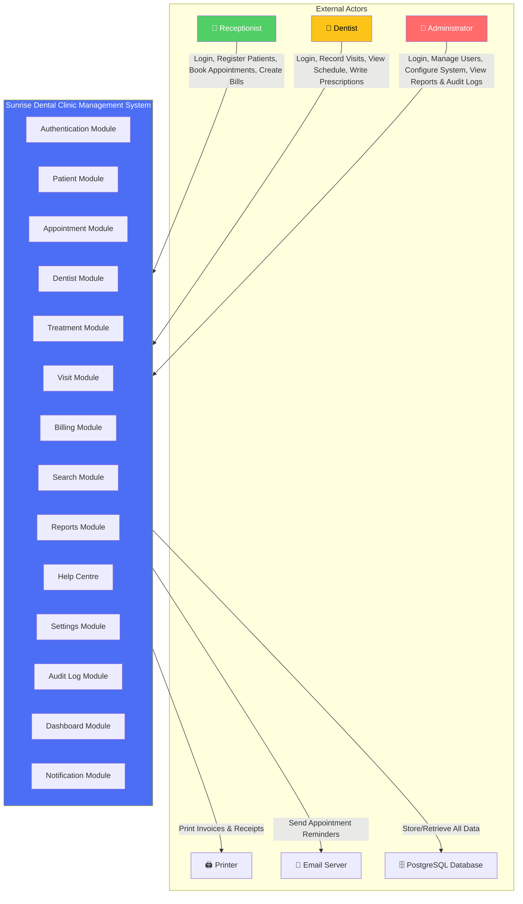
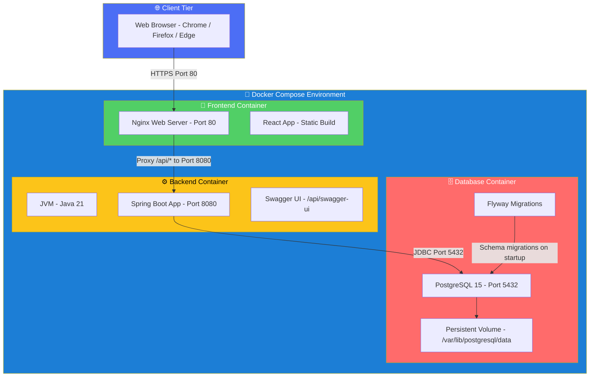

# SDCMS Enterprise Diagrams — Part 2: Use Cases & System Context

**Document ID:** SDC-DIA-002  
**Version:** 1.0  
**Date:** 14 July 2026  

---

## 1. System Context Diagram

Shows the SDCMS as a black box with all external actors and their interactions.

### 1.1 Context Diagram Explanation

| Actor | Type | Interaction |
|---|---|---|
| Receptionist | Primary User | Manages patients, appointments, and billing |
| Dentist | Primary User | Records clinical visits, diagnoses, prescriptions |
| Administrator | Power User | Manages users, settings, views audit logs and full reports |
| PostgreSQL Database | External System | Persists all application data |
| Printer | External Device | Outputs physical invoices and receipts |
| Email Server | External System | Delivers appointment reminders and notifications |

---

## 2. Use Case Diagram

Complete use case diagram with all actors and all system functions grouped by module.

```mermaid
flowchart LR
    subgraph Actors
        R["👤 Receptionist"]
        D["🦷 Dentist"]
        A["🔧 Administrator"]
    end

    subgraph UC_AUTH["Authentication"]
        UC1["UC-01: Login"]
        UC2["UC-02: Logout"]
        UC3["UC-03: Change Password"]
        UC4["UC-04: Forgot Password"]
    end

    subgraph UC_PAT["Patient Management"]
        UC5["UC-05: Register Patient"]
        UC6["UC-06: Update Patient"]
        UC7["UC-07: View Patient"]
        UC8["UC-08: Search Patient"]
        UC9["UC-09: Deactivate Patient"]
        UC10["UC-10: View Patient History"]
    end

    subgraph UC_APT["Appointment Management"]
        UC11["UC-11: Schedule Appointment"]
        UC12["UC-12: Reschedule Appointment"]
        UC13["UC-13: Cancel Appointment"]
        UC14["UC-14: View Today Appointments"]
        UC15["UC-15: View Future Appointments"]
        UC16["UC-16: Search Appointments"]
        UC17["UC-17: Confirm Appointment"]
        UC18["UC-18: Mark No-Show"]
    end

    subgraph UC_DEN["Dentist Management"]
        UC19["UC-19: Add Dentist"]
        UC20["UC-20: Update Dentist Profile"]
        UC21["UC-21: Set Working Hours"]
        UC22["UC-22: View Dentist Schedule"]
        UC23["UC-23: Check Availability"]
    end

    subgraph UC_TRT["Treatment Management"]
        UC24["UC-24: Add Treatment"]
        UC25["UC-25: Update Treatment"]
        UC26["UC-26: View Treatment Catalogue"]
        UC27["UC-27: Deactivate Treatment"]
    end

    subgraph UC_VIS["Visit Management"]
        UC28["UC-28: Record Patient Visit"]
        UC29["UC-29: Add Diagnosis"]
        UC30["UC-30: Add Prescription"]
        UC31["UC-31: Add Treatments to Visit"]
        UC32["UC-32: Set Follow-up Date"]
        UC33["UC-33: Complete Visit"]
    end

    subgraph UC_BIL["Billing"]
        UC34["UC-34: Generate Bill"]
        UC35["UC-35: Apply Discount"]
        UC36["UC-36: Record Payment"]
        UC37["UC-37: Print Invoice"]
        UC38["UC-38: Download PDF Receipt"]
        UC39["UC-39: View Billing History"]
    end

    subgraph UC_RPT["Reports"]
        UC40["UC-40: Daily Appointments Report"]
        UC41["UC-41: Monthly Revenue Report"]
        UC42["UC-42: Dentist Performance Report"]
        UC43["UC-43: Popular Treatments Report"]
        UC44["UC-44: Patient Statistics Report"]
        UC45["UC-45: Cancelled Appointments Report"]
        UC46["UC-46: Revenue Dashboard"]
    end

    subgraph UC_SYS["System"]
        UC47["UC-47: Global Search"]
        UC48["UC-48: View Notifications"]
        UC49["UC-49: View Help Centre"]
        UC50["UC-50: Manage Users"]
        UC51["UC-51: Configure Settings"]
        UC52["UC-52: View Audit Logs"]
        UC53["UC-53: Export to PDF"]
        UC54["UC-54: Export to Excel"]
        UC55["UC-55: Toggle Dark Mode"]
        UC56["UC-56: View Dashboard"]
    end

    R --> UC1 & UC2 & UC3
    R --> UC5 & UC6 & UC7 & UC8 & UC9 & UC10
    R --> UC11 & UC12 & UC13 & UC14 & UC15 & UC16 & UC17 & UC18
    R --> UC22 & UC23
    R --> UC26
    R --> UC34 & UC35 & UC36 & UC37 & UC38 & UC39
    R --> UC47 & UC48 & UC49 & UC53 & UC54 & UC55 & UC56

    D --> UC1 & UC2 & UC3
    D --> UC7 & UC10
    D --> UC14 & UC22
    D --> UC26
    D --> UC28 & UC29 & UC30 & UC31 & UC32 & UC33
    D --> UC39
    D --> UC42
    D --> UC47 & UC48 & UC49 & UC53 & UC54 & UC55 & UC56

    A --> UC1 & UC2 & UC3 & UC4
    A --> UC5 & UC6 & UC7 & UC8 & UC9 & UC10
    A --> UC11 & UC12 & UC13 & UC14 & UC15 & UC16 & UC17 & UC18
    A --> UC19 & UC20 & UC21 & UC22 & UC23
    A --> UC24 & UC25 & UC26 & UC27
    A --> UC28 & UC29 & UC30 & UC31 & UC32 & UC33
    A --> UC34 & UC35 & UC36 & UC37 & UC38 & UC39
    A --> UC40 & UC41 & UC42 & UC43 & UC44 & UC45 & UC46
    A --> UC47 & UC48 & UC49 & UC50 & UC51 & UC52 & UC53 & UC54 & UC55 & UC56

    style UC_AUTH fill:#4c6ef5,color:#fff
    style UC_PAT fill:#51cf66,color:#fff
    style UC_APT fill:#fcc419,color:#000
    style UC_DEN fill:#ff922b,color:#fff
    style UC_TRT fill:#cc5de8,color:#fff
    style UC_VIS fill:#20c997,color:#fff
    style UC_BIL fill:#ff6b6b,color:#fff
    style UC_RPT fill:#339af0,color:#fff
    style UC_SYS fill:#868e96,color:#fff
```

### 2.1 Use Case Summary

| Module | Use Cases | Receptionist | Dentist | Administrator |
|---|---|---|---|---|
| Authentication | UC-01 to UC-04 | 3/4 | 3/4 | 4/4 |
| Patient Management | UC-05 to UC-10 | 6/6 | 2/6 | 6/6 |
| Appointment Management | UC-11 to UC-18 | 8/8 | 2/8 | 8/8 |
| Dentist Management | UC-19 to UC-23 | 2/5 | 2/5 | 5/5 |
| Treatment Management | UC-24 to UC-27 | 1/4 | 1/4 | 4/4 |
| Visit Management | UC-28 to UC-33 | 0/6 | 6/6 | 6/6 |
| Billing | UC-34 to UC-39 | 6/6 | 1/6 | 6/6 |
| Reports | UC-40 to UC-46 | 0/7 | 1/7 | 7/7 |
| System | UC-47 to UC-56 | 7/10 | 7/10 | 10/10 |
| **Total** | **56** | **33** | **25** | **56** |

---

## 3. Use Case Specifications (Key Use Cases)

### UC-11: Schedule Appointment

| Field | Detail |
|---|---|
| **ID** | UC-11 |
| **Name** | Schedule Appointment |
| **Actor** | Receptionist, Administrator |
| **Precondition** | Actor is logged in; Patient is registered and ACTIVE; Dentist exists and is ACTIVE |
| **Trigger** | Actor clicks "New Appointment" button |
| **Main Flow** | 1. Actor selects patient (search by name/NIC) → 2. Actor selects dentist → 3. Actor selects date → 4. System displays available time slots based on dentist schedule → 5. Actor selects time slot → 6. System validates no conflicts exist → 7. System creates appointment with auto-generated APT number → 8. System displays confirmation → 9. Audit log entry created |
| **Alternative Flow** | 5a. Selected slot has conflict → System displays error with alternative slots → Return to step 5 |
| **Postcondition** | Appointment is created with status SCHEDULED; Appointment number generated; Audit log recorded |
| **Business Rules** | BR-A01, BR-A02, BR-A03, BR-A06, BR-A07 |

### UC-34: Generate Bill

| Field | Detail |
|---|---|
| **ID** | UC-34 |
| **Name** | Generate Bill |
| **Actor** | Receptionist, Administrator |
| **Precondition** | Patient visit exists with at least one treatment recorded; Visit status is COMPLETED |
| **Trigger** | Actor clicks "Generate Bill" on completed visit |
| **Main Flow** | 1. System retrieves visit details with treatments → 2. System auto-populates consultation fee from dentist profile → 3. System calculates treatment total from visit_treatments → 4. System calculates sub_total → 5. Actor optionally applies discount → 6. System calculates tax → 7. System computes final_total → 8. System generates bill with auto-generated INV number → 9. Actor can print or download PDF |
| **Alternative Flow** | 5a. Discount exceeds 50% → System shows validation error → Return to step 5 |
| **Postcondition** | Bill created with status PENDING; Bill number generated; Audit log recorded |
| **Business Rules** | BR-B01, BR-B02, BR-B03, BR-B04, BR-B06 |

---

## 4. Package Diagram (Application Layers)

```mermaid
flowchart TB
    subgraph Presentation["📱 Presentation Layer - React / TypeScript"]
        P1["Pages / Views"]
        P2["Components"]
        P3["Hooks"]
        P4["Context Providers"]
        P5["API Client - Axios"]
    end

    subgraph API["🔌 API Layer - REST Controllers"]
        A1["AuthController"]
        A2["PatientController"]
        A3["AppointmentController"]
        A4["DentistController"]
        A5["TreatmentController"]
        A6["VisitController"]
        A7["BillController"]
        A8["ReportController"]
        A9["SearchController"]
        A10["SettingsController"]
        A11["NotificationController"]
        A12["AuditLogController"]
        A13["DashboardController"]
    end

    subgraph Security["🔒 Security Layer"]
        S1["JwtAuthenticationFilter"]
        S2["JwtTokenProvider"]
        S3["SecurityConfig"]
        S4["UserDetailsServiceImpl"]
    end

    subgraph Service["⚙️ Service Layer - Business Logic"]
        SV1["AuthService"]
        SV2["PatientService"]
        SV3["AppointmentService"]
        SV4["DentistService"]
        SV5["TreatmentService"]
        SV6["VisitService"]
        SV7["BillService"]
        SV8["ReportService"]
        SV9["SearchService"]
        SV10["SettingsService"]
        SV11["NotificationService"]
        SV12["AuditLogService"]
        SV13["PdfService"]
        SV14["ExcelService"]
    end

    subgraph Repository["📦 Repository Layer - Spring Data JPA"]
        R1["UserRepository"]
        R2["PatientRepository"]
        R3["AppointmentRepository"]
        R4["DentistRepository"]
        R5["DentistScheduleRepository"]
        R6["TreatmentRepository"]
        R7["VisitRepository"]
        R8["VisitTreatmentRepository"]
        R9["BillRepository"]
        R10["AuditLogRepository"]
        R11["NotificationRepository"]
        R12["ClinicSettingsRepository"]
    end

    subgraph Persistence["🗄️ Persistence Layer - PostgreSQL + Flyway"]
        DB1["users"]
        DB2["patients"]
        DB3["dentists"]
        DB4["dentist_schedules"]
        DB5["treatments"]
        DB6["appointments"]
        DB7["patient_visits"]
        DB8["visit_treatments"]
        DB9["bills"]
        DB10["audit_logs"]
        DB11["notifications"]
        DB12["clinic_settings"]
    end

    Presentation --> API
    API --> Security
    Security --> Service
    Service --> Repository
    Repository --> Persistence

    style Presentation fill:#4c6ef5,color:#fff
    style API fill:#51cf66,color:#fff
    style Security fill:#ff6b6b,color:#fff
    style Service fill:#fcc419,color:#000
    style Repository fill:#cc5de8,color:#fff
    style Persistence fill:#868e96,color:#fff
```

### 4.1 Layer Responsibilities

| Layer | Responsibility | Rules |
|---|---|---|
| **Presentation** | UI rendering, user interaction, API calls | No business logic; only display logic and form validation |
| **API (Controller)** | HTTP request/response handling, DTO mapping | No business logic; delegates to services; handles validation annotations |
| **Security** | Authentication, authorisation, JWT processing | Intercepts every request; validates tokens; enforces role-based access |
| **Service** | Business logic, orchestration, transaction management | All business rules live here; uses @Transactional; calls repositories |
| **Repository** | Data access abstraction | Spring Data JPA interfaces; custom JPQL queries; no business logic |
| **Persistence** | Physical data storage | PostgreSQL; Flyway migrations; indexes; constraints |

---

## 5. Deployment Diagram

### 5.1 Deployment Architecture Explanation

| Component | Technology | Port | Purpose |
|---|---|---|---|
| **Nginx** | nginx:alpine | 80 | Serves React static files; reverse-proxies /api/* to backend |
| **Spring Boot** | Java 21 + Spring Boot 3.x | 8080 | REST API server; JWT authentication; business logic |
| **PostgreSQL** | PostgreSQL 15 | 5432 | Relational data store; persistent volume mounted |
| **Flyway** | Embedded in Spring Boot | — | Runs schema migrations on application startup |
| **Swagger UI** | springdoc-openapi | 8080/api/swagger-ui | Interactive API documentation |

---

## 6. Component Diagram

```mermaid
flowchart LR
    subgraph Frontend["React Frontend"]
        AUTH_C["Auth Components"]
        PAT_C["Patient Components"]
        APT_C["Appointment Components"]
        DEN_C["Dentist Components"]
        TRT_C["Treatment Components"]
        VIS_C["Visit Components"]
        BIL_C["Billing Components"]
        RPT_C["Report Components"]
        DASH_C["Dashboard Components"]
        SET_C["Settings Components"]
        HELP_C["Help Components"]
        COMMON["Shared Components - Tables, Forms, Charts, Modals"]
    end

    subgraph APIGateway["REST API Gateway"]
        ROUTER["Spring MVC Router"]
        JWT_FILTER["JWT Authentication Filter"]
        CORS["CORS Configuration"]
        RATE["Rate Limiter"]
    end

    subgraph Backend["Spring Boot Backend"]
        CTRL["Controllers - 13 controllers"]
        SVC["Services - 14 services"]
        REPO["Repositories - 12 repositories"]
        DTO["DTOs and Mappers"]
        VALID["Validation Layer"]
        EXCEPT["Global Exception Handler"]
        AUDIT_SVC["Audit Interceptor"]
    end

    subgraph DataLayer["Data Layer"]
        JPA["JPA / Hibernate"]
        PG_DB["PostgreSQL"]
        FW["Flyway"]
        CACHE["Query Cache"]
    end

    Frontend -->|"HTTP/JSON"| APIGateway
    APIGateway --> Backend
    Backend --> DataLayer

    style Frontend fill:#4c6ef5,color:#fff
    style APIGateway fill:#ff6b6b,color:#fff
    style Backend fill:#51cf66,color:#fff
    style DataLayer fill:#fcc419,color:#000
```

