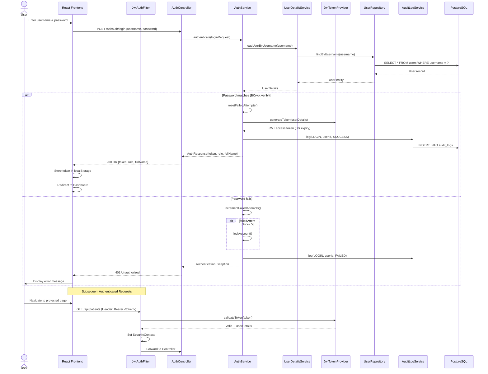
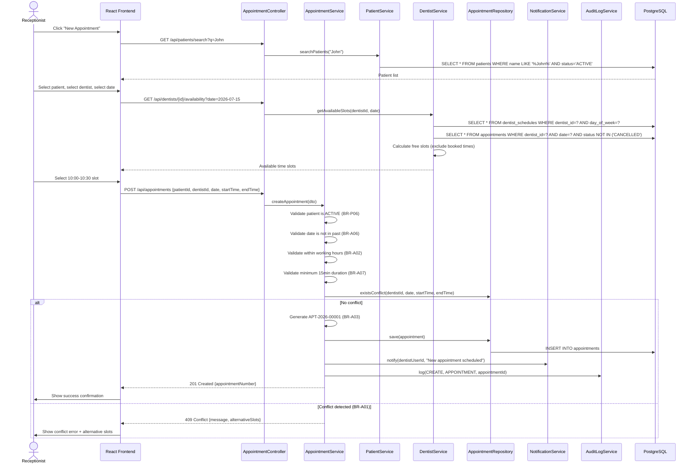
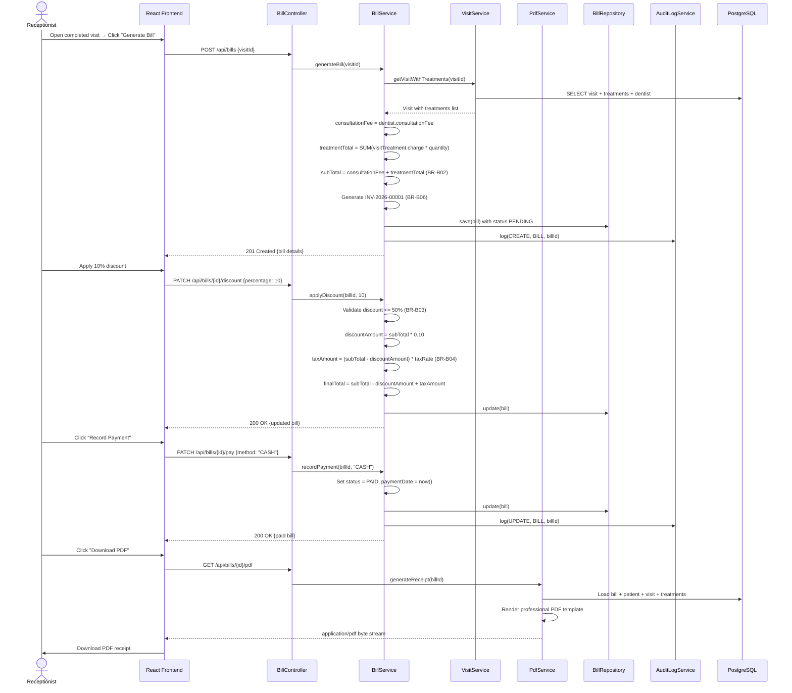
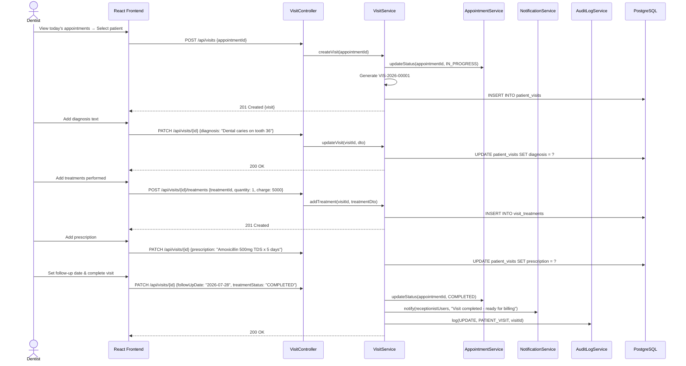
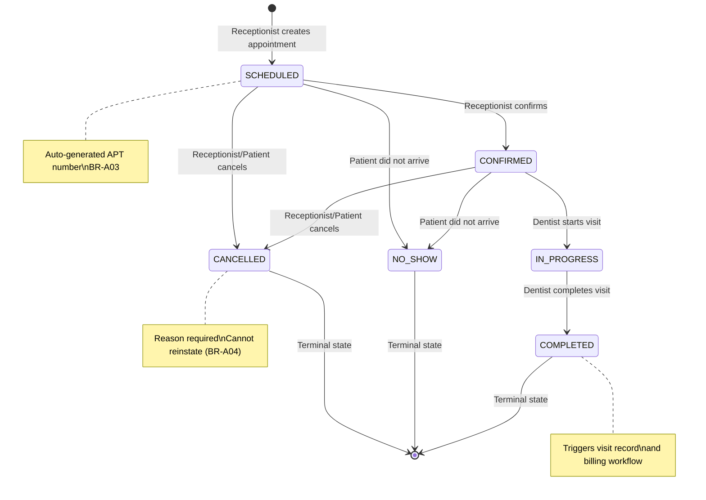
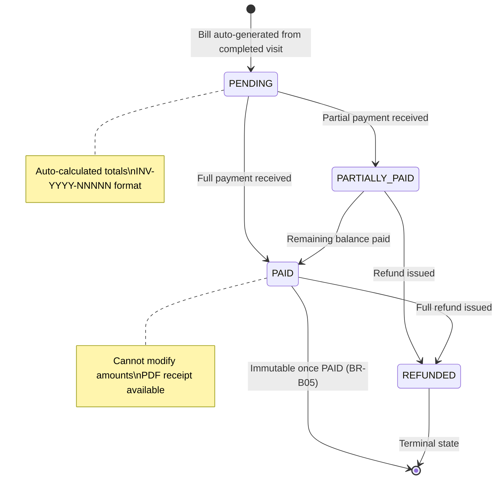
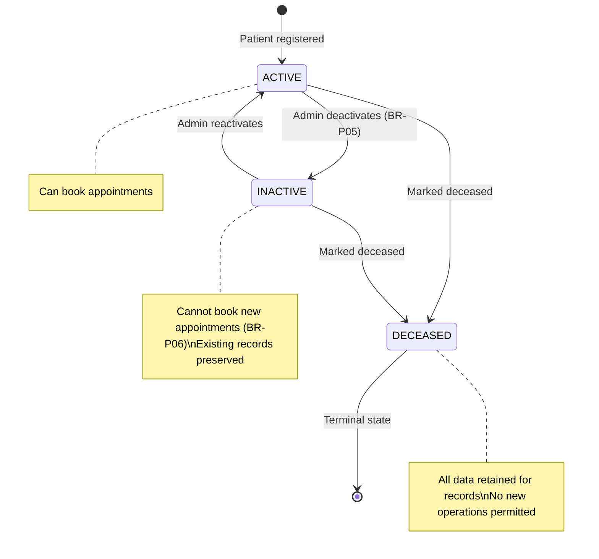
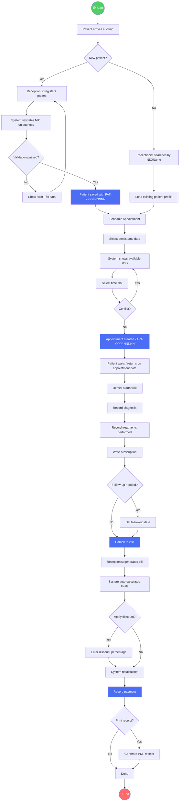
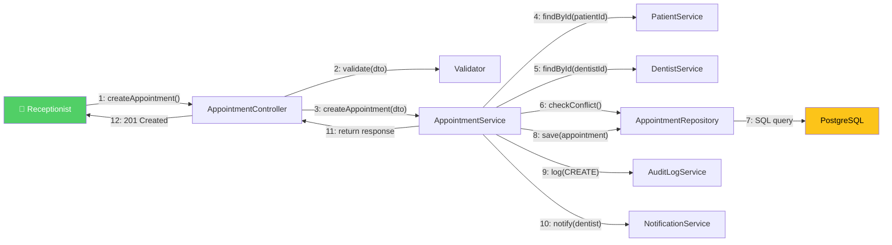

# SDCMS Enterprise Diagrams — Part 3: Workflows & Sequences

**Document ID:** SDC-DIA-003 | **Version:** 1.0 | **Date:** 14 July 2026

---

## 1. Authentication Flow (Login → JWT → Access)

**Design Decisions:**
- BCrypt strength ≥ 12 for password hashing (BR-S01)
- JWT expires after 8 hours (BR-S02)
- Account locks after 5 failed attempts (BR-S03)
- Every login attempt is audit-logged (BR-S05)

---

## 2. Appointment Scheduling Workflow

---

## 3. Billing & Payment Workflow

---

## 4. Patient Visit & Treatment Recording

---

## 5. Appointment State Machine

---

## 6. Bill Payment State Machine

---

## 7. Patient Status State Machine

---

## 8. Activity Diagram — End-to-End Patient Journey

---

## 9. Navigation Diagram (Frontend Page Flow)

```mermaid
flowchart TD
    LOGIN["Login Page"] --> DASH["Dashboard"]

    DASH --> PAT["Patient Management"]
    DASH --> APT["Appointment Management"]
    DASH --> DEN["Dentist Management"]
    DASH --> TRT["Treatment Management"]
    DASH --> VIS["Visit Management"]
    DASH --> BIL["Billing"]
    DASH --> RPT["Reports"]
    DASH --> SRCH["Global Search"]
    DASH --> HELP["Help Centre"]
    DASH --> SET["Settings"]
    DASH --> AUDIT["Audit Logs"]
    DASH --> NOTIF["Notifications"]
    DASH --> PROF["Profile"]

    PAT --> PAT_LIST["Patient List"]
    PAT --> PAT_ADD["Add Patient Form"]
    PAT --> PAT_VIEW["Patient Detail View"]
    PAT_VIEW --> PAT_HIST["Patient History Timeline"]

    APT --> APT_LIST["Appointments List"]
    APT --> APT_TODAY["Today's Appointments"]
    APT --> APT_ADD["Schedule Appointment"]
    APT --> APT_VIEW["Appointment Detail"]

    DEN --> DEN_LIST["Dentist List"]
    DEN --> DEN_ADD["Add Dentist"]
    DEN --> DEN_VIEW["Dentist Profile + Schedule"]

    VIS --> VIS_LIST["Visits List"]
    VIS --> VIS_REC["Record Visit"]
    VIS --> VIS_VIEW["Visit Detail"]

    BIL --> BIL_LIST["Bills List"]
    BIL --> BIL_GEN["Generate Bill"]
    BIL --> BIL_VIEW["Invoice Detail"]
    BIL_VIEW --> BIL_PDF["PDF Receipt Download"]

    RPT --> RPT_DAILY["Daily Report"]
    RPT --> RPT_REV["Revenue Report"]
    RPT --> RPT_PERF["Dentist Performance"]
    RPT --> RPT_POP["Popular Treatments"]
    RPT --> RPT_STAT["Patient Statistics"]

    SET --> SET_CLINIC["Clinic Details"]
    SET --> SET_PRICE["Treatment Prices"]
    SET --> SET_USER["User Accounts"]
    SET --> SET_PREF["Preferences"]

    PROF --> PROF_EDIT["Edit Profile"]
    PROF --> PROF_PWD["Change Password"]

    style LOGIN fill:#ff6b6b,color:#fff
    style DASH fill:#4c6ef5,color:#fff
```

---

## 10. Communication Diagram — Appointment Creation

---

## Diagram Index

| # | Diagram | Type | File |
|---|---|---|---|
| 1 | Entity Relationship Diagram | ER | Part 1 |
| 2 | Domain Class Diagram | Class | Part 1 |
| 3 | System Context Diagram | Context | Part 2 |
| 4 | Use Case Diagram (56 use cases) | Use Case | Part 2 |
| 5 | Use Case Specifications | Specification | Part 2 |
| 6 | Package Diagram | Package | Part 2 |
| 7 | Deployment Diagram | Deployment | Part 2 |
| 8 | Component Diagram | Component | Part 2 |
| 9 | Authentication Sequence | Sequence | Part 3 |
| 10 | Appointment Scheduling Sequence | Sequence | Part 3 |
| 11 | Billing & Payment Sequence | Sequence | Part 3 |
| 12 | Patient Visit Sequence | Sequence | Part 3 |
| 13 | Appointment State Machine | State | Part 3 |
| 14 | Bill Payment State Machine | State | Part 3 |
| 15 | Patient Status State Machine | State | Part 3 |
| 16 | End-to-End Patient Journey | Activity | Part 3 |
| 17 | Navigation Diagram | Navigation | Part 3 |
| 18 | Communication Diagram | Communication | Part 3 |
| **Total** | **18 enterprise-level Mermaid diagrams** | | |
