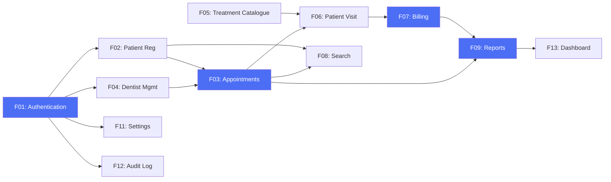

# Sunrise Dental Clinic Management System — Vision Document

**Document ID:** SDC-VIS-001  
**Version:** 1.0  
**Date:** 14 July 2026  
**Author:** Business Analyst — Vareka Engineering Team  
**Status:** Awaiting Approval  

---

## 1. Introduction

### 1.1 Purpose

This Vision Document defines the high-level scope, objectives, and strategic direction for the **Sunrise Dental Clinic Management System (SDCMS)**. It provides all stakeholders with a shared understanding of the product's purpose, target users, key capabilities, and success criteria.

### 1.2 Scope

The SDCMS is a full-stack web application designed to replace the entirely paper-based operations of Sunrise Dental Clinic, Colombo. It encompasses patient management, appointment scheduling, treatment recording, billing, reporting, and administrative functions within a secure, role-based platform.

### 1.3 References

| Document | ID |
|---|---|
| Business Analysis | SDC-BA-001 |
| Software Requirements Specification | SDC-SRS-001 (Phase 2) |
| Architecture Design Document | SDC-ADD-001 (Phase 3) |

---

## 2. Product Vision Statement

> **For** Sunrise Dental Clinic staff (receptionists, dentists, and administrators)  
> **Who** need to manage patients, appointments, treatments, and billing efficiently and securely,  
> **The** Sunrise Dental Clinic Management System  
> **Is a** secure, enterprise-grade web application  
> **That** digitises all clinic operations, eliminates paper-based errors, and provides real-time analytics.  
> **Unlike** the current manual paper-based system,  
> **Our product** provides automated double-booking prevention, instant patient record retrieval, automated billing, professional PDF receipts, comprehensive dashboards, and a complete audit trail — all within a modern, intuitive interface.

---

## 3. Problem & Opportunity

### 3.1 The Problem

| Aspect | Detail |
|---|---|
| **The problem of** | Managing all clinic operations through paper-based, manual processes |
| **Affects** | Receptionists (workload), Dentists (record accuracy), Administrators (reporting), Patients (wait times), Owner (revenue) |
| **The impact is** | Double bookings, lost records, billing errors, zero auditability, no reporting, security vulnerabilities, scalability ceiling |
| **A successful solution** | Would eliminate 100% of paper processes, prevent scheduling conflicts, automate billing, enable real-time dashboards, and secure all patient data |

### 3.2 The Opportunity

The Sri Lankan private healthcare sector is experiencing rapid digital transformation. By adopting SDCMS, Sunrise Dental Clinic positions itself as a modern, efficient, and trustworthy healthcare provider — differentiating from competitors still reliant on paper records and enabling future multi-branch expansion.

---

## 4. User & Stakeholder Descriptions

### 4.1 User Profiles

| User | Role | Technical Proficiency | Key Responsibility |
|---|---|---|---|
| **Receptionist** | Frontline operator | Basic to Intermediate | Patient registration, appointment scheduling, billing, search |
| **Dentist** | Clinical professional | Intermediate | Treatment recording, diagnosis, prescriptions, patient history review |
| **Administrator** | System manager | Intermediate to Advanced | User management, system configuration, reporting, audit review |

### 4.2 Key User Needs

#### Receptionist Needs

| # | Need | Priority | Current Solution | Problem with Current Solution |
|---|---|---|---|---|
| RN1 | Register patients quickly | Critical | Paper form + filing cabinet | 8–12 minutes per patient; no duplicate detection |
| RN2 | Schedule appointments without conflicts | Critical | Notebook | Double bookings; manual search for free slots |
| RN3 | Generate accurate bills | High | Manual calculation | Arithmetic errors; no standard formula |
| RN4 | Search patient records instantly | High | Browse filing cabinet | 5–20 minutes retrieval time |
| RN5 | Print professional receipts | Medium | Handwritten receipt | Unprofessional; illegible carbon copies |

#### Dentist Needs

| # | Need | Priority | Current Solution | Problem with Current Solution |
|---|---|---|---|---|
| DN1 | View complete patient history | Critical | Paper folder | Often missing or incomplete |
| DN2 | Record treatments and prescriptions | Critical | Handwritten notes | Illegible; no structured data |
| DN3 | View own schedule | High | Ask receptionist | No self-service; time wasted |
| DN4 | Track follow-up appointments | Medium | Memory / sticky notes | Forgotten follow-ups |

#### Administrator Needs

| # | Need | Priority | Current Solution | Problem with Current Solution |
|---|---|---|---|---|
| AN1 | View revenue reports | Critical | Manual counting of receipts | Takes hours; inaccurate |
| AN2 | Manage user access | Critical | Physical key to filing cabinet | No granularity; no logging |
| AN3 | Configure treatment prices | High | Update price list on paper | Inconsistently applied |
| AN4 | Monitor system usage | Medium | Not possible | Zero visibility |

---

## 5. Product Features

### 5.1 Feature Priority Matrix

| # | Feature | Priority | Business Value | Complexity | Phase |
|---|---|---|---|---|---|
| F01 | Authentication & Authorisation (JWT + RBAC) | Critical | High | Medium | Core |
| F02 | Patient Registration (Full CRUD) | Critical | High | Medium | Core |
| F03 | Appointment Management (with conflict prevention) | Critical | High | High | Core |
| F04 | Dentist Management | High | Medium | Low | Core |
| F05 | Treatment Catalogue | High | Medium | Low | Core |
| F06 | Patient Visit Recording | Critical | High | Medium | Core |
| F07 | Billing & PDF Invoicing | Critical | High | High | Core |
| F08 | Multi-Criteria Search | High | High | Medium | Core |
| F09 | Reports & Analytics Dashboard | High | High | High | Core |
| F10 | Help Centre | Medium | Medium | Low | Core |
| F11 | Settings & Configuration | Medium | Medium | Low | Core |
| F12 | Audit Logging | High | High | Medium | Core |
| F13 | Real-time Dashboard | High | High | Medium | Enhancement |
| F14 | Dark Mode | Low | Low | Low | Enhancement |
| F15 | Export (PDF/Excel) | Medium | Medium | Medium | Enhancement |
| F16 | In-App Notifications | Medium | Medium | Medium | Enhancement |
| F17 | Patient History Timeline | Medium | Medium | Medium | Enhancement |

### 5.2 Feature Dependency Map

---

## 6. Product Positioning

### 6.1 Competitive Landscape

| Feature | Paper System | Generic Spreadsheet | Basic Clinic Software | **SDCMS** |
|---|---|---|---|---|
| Patient Registration | Manual form | Typed entry | Basic form | ✅ Full CRUD + validation + duplicate detection |
| Double Booking Prevention | ❌ None | ❌ None | ⚠️ Basic | ✅ Automated constraint-based |
| Billing Accuracy | ❌ Manual math | ⚠️ Formulas | ⚠️ Basic | ✅ Automated + PDF receipts |
| Reporting | ❌ None | ⚠️ Manual charts | ⚠️ Basic | ✅ Real-time dashboards + export |
| Security | ❌ Physical lock | ❌ File password | ⚠️ Basic login | ✅ JWT + RBAC + audit trail |
| Audit Trail | ❌ None | ❌ None | ❌ None | ✅ Complete action logging |
| Scalability | ❌ Filing cabinets fill | ❌ File size limits | ⚠️ Limited | ✅ Enterprise database + Docker |
| Professional UI | ❌ N/A | ❌ N/A | ⚠️ Dated | ✅ Modern Material UI + dark mode |

### 6.2 Unique Value Propositions

1. **Enterprise Architecture in a Clinic Context** — Layered architecture (Controller → Service → Repository) ensures the system scales from 1 to 10+ branches without rewriting.
2. **Zero-Configuration Double Booking Prevention** — Database-level constraints combined with application-level validation make scheduling errors technically impossible.
3. **One-Click PDF Receipts** — Professional invoices generated instantly, replacing handwritten receipts.
4. **Real-Time Revenue Dashboard** — Management sees financial performance in real-time, not after month-end manual tallying.
5. **Complete Audit Trail** — Every data change is logged with who, what, when, and why — critical for healthcare compliance.

---

## 7. Constraints & Dependencies

### 7.1 Constraints

| Constraint | Description |
|---|---|
| Technology | Must use Java 21/Spring Boot backend, React/TypeScript frontend, PostgreSQL database |
| Timeline | Bound by academic submission schedule |
| Resources | Single-developer project |
| Deployment | Must run on standard development hardware via Docker Compose |

### 7.2 Dependencies

| Dependency | Impact if Unavailable |
|---|---|
| Java 21 JDK | Cannot compile backend |
| Node.js 18+ | Cannot build frontend |
| PostgreSQL 15+ | Cannot persist data |
| Docker | Cannot containerise deployment |
| Maven Central | Cannot resolve backend dependencies |
| npm Registry | Cannot resolve frontend dependencies |

---

## 8. Quality Attributes

| Attribute | Target | Justification |
|---|---|---|
| **Performance** | API response < 500ms (95th percentile) | Staff expect near-instant response |
| **Security** | OWASP Top 10 compliance | Healthcare data is sensitive |
| **Availability** | 99.5% during operating hours | Clinic cannot revert to paper mid-day |
| **Scalability** | Support 500 concurrent users | Multi-branch future expansion |
| **Usability** | Learnable in < 2 hours training | Non-technical reception staff |
| **Maintainability** | Clean architecture; SOLID principles | Long-term evolution cost reduction |
| **Testability** | ≥ 80% code coverage | Academic excellence; production confidence |
| **Portability** | Docker containerised | Deploy anywhere with Docker support |

---

## 9. Release Criteria

### 9.1 Minimum Viable Release

- All 12 core features fully functional
- JWT authentication with 3 roles operational
- Double booking prevention verified
- PDF receipt generation working
- Dashboard with at least 3 chart widgets
- Help centre with user guide
- ≥ 80% test coverage
- Docker Compose deployment operational
- All API endpoints documented in Swagger
- No critical or high-severity bugs

### 9.2 Quality Gate Checklist

- [ ] All unit tests pass
- [ ] All integration tests pass
- [ ] API tests pass via Postman collection
- [ ] Security review completed (no critical findings)
- [ ] Performance benchmarks met (< 500ms p95)
- [ ] Accessibility baseline met
- [ ] Documentation complete
- [ ] Docker Compose full-stack deployment verified

---

## 10. Milestones

| Phase | Milestone | Deliverable |
|---|---|---|
| 1 | Business Analysis Complete | Business Analysis + Vision Document |
| 2 | Requirements Finalised | Software Requirements Specification |
| 3 | Architecture Approved | Architecture Design Document |
| 4 | Database Designed | Schema, Migrations, Seed Data |
| 5 | UML Complete | All 16+ diagrams |
| 6 | UI/UX Designed | Wireframes + Design System |
| 7 | Backend Built | Spring Boot API + Tests |
| 8 | Frontend Built | React Application + Tests |
| 9 | Testing Complete | Test Reports + Coverage |
| 10 | Documentation Complete | All 15+ documents |
| 11 | Deployment Ready | Docker Compose + CI/CD |

---

> **This document is part of Phase 1: Business Analysis.**
